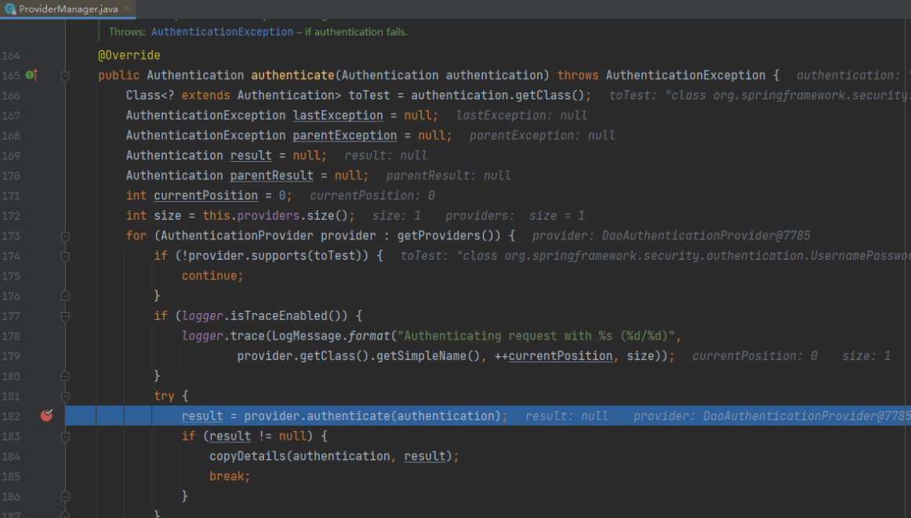
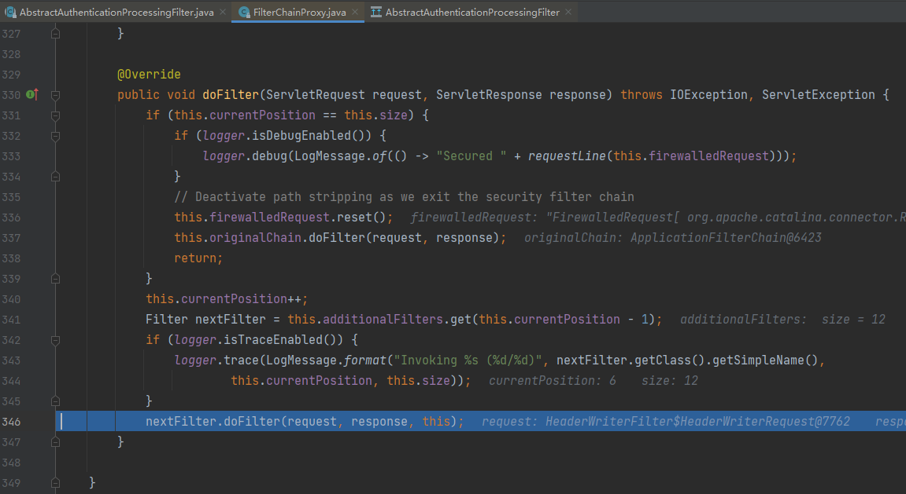

# SpringSecurity6笔记

> https://www.yuque.com/chengxuyuanyideng/prp17u/oa6ekik6sntmmgxk
>
> 2023年9月28日14:29:36
>
> 权限框架本质上就是过滤器，如果学SpringSecurity吃力，就回去再好好看一下Servlet过滤器。

## 简介

> 早期都是XML配置，学习成本很高，自从出了SpringBoot版本之后，又火起来了。

Spring Security 的前身是Acegi Security，在被收纳为Spring 子项目后正式更名为Spring Security。Spring Security目前已经到了6.x，并且加入了原生OAuth2.0框架，支持更加现代化的密码加密方式。可以预见，在Java应用安全领域，Spring Security会成为被首先推崇的解决方案，就像我们看到服务器就会联想到Linux一样顺理成章。

**应用程序的安全性通常体现在两个方面：认证和授权。**

* **认证**是确认某主体在某系统中是否合法、可用的过程。这里的主体既可以是登录系统的用户，也可以是接入的设备或者其他系统。

* **授权**是指当主体通过认证之后，是否允许其执行某项操作的过程。

这些概念并非Spring Security独有，而是应用安全的基本关注点。Spring Security可以帮助我们更便捷地完成认证和授权。

Spring Security 支持广泛的认证技术，这些认证技术大多由第三方或相关标准组织开发。Spring Security已经集成的认证技术如下：

◎ HTTP BASIC authentication headers：一个基于IETF RFC的标准。

◎ HTTP Digest authentication headers：一个基于IETF RFC的标准。

◎ HTTP X.509 client certificate exchange：一个基于IETF RFC的标准。

◎ LDAP：一种常见的跨平台身份验证方式。

◎ Form-based authentication：用于简单的用户界面需求。

◎ OpenID authentication：一种去中心化的身份认证方式。

◎ Authentication based on pre-established request headers：类似于Computer Associates SiteMinder，一种用户身份验证及授权的集中式安全基础方案。

◎ Jasig Central Authentication Service：单点登录方案。

◎ Transparent authentication context propagation for Remote Method Invocation（RMI）and HttpInvoker：一个Spring远程调用协议。

◎ Automatic "remember-me" authentication：允许在指定到期时间前自行重新登录系统。

◎ Anonymous authentication：允许匿名用户使用特定的身份安全访问资源。

◎ Run-as authentication：允许在一个会话中变换用户身份的机制。

◎ Java Authentication and Authorization Service:JAAS,Java验证和授权API。

◎ Java EE container authentication：允许系统继续使用容器管理这种身份验证方式。

◎ Kerberos：一种使用对称密钥机制，允许客户端与服务器相互确认身份的认证协议。

除此之外，Spring Security还引入了一些第三方包，用于支持更多的认证技术，如JOSSO等。如果所有这些技术都无法满足需求，则Spring Security允许我们编写自己的认证技术。因此，在绝大部分情况下，当我们有Java应用安全方面的需求时，选择Spring Security往往是正确而有效的。

Internet工程任务组（Internet Engineering Task Force,IETF）是推动Internet标准规范制定的最主要的组织。请求注解（Request For Comments,RFC）包含大多数关于Internet的重要文字资料，被称为“网络知识圣经”。

**在授权上，Spring Security不仅支持基于URL对Web的请求授权，还支持方法访问授权、对象访问授权等，基本涵盖常见的大部分授权场景。**

很多时候，一个系统的安全性完全取决于系统开发人员的安全意识。例如，在我们从未听过SQL 注入时，如何意识到要对SQL注入做防护？关于Web系统安全的攻击方式非常多，诸如：XSS、CSRF 等，未来还会暴露出更多的攻击方式，我们只有在充分了解其攻击原理后，才能提出完善而有效的防护策略。在笔者看来，学习Spring Security并非局限于降低Java应用的安全开发成本，通过Spring Security了解常见的安全攻击手段以及对应的防护方法也尤为重要，这些是脱离具体开发语言而存在的。

### 创建一个简单的SpringSecurity项目

本节创建一个简单的Spring Security项目，带领大家初步领略Spring Security带来的便利。下面我们就完整地“走”一遍创建项目的流程。

~~~java
<?xml version="1.0" encoding="UTF-8"?>
<project xmlns="http://maven.apache.org/POM/4.0.0" xmlns:xsi="http://www.w3.org/2001/XMLSchema-instance"
         xsi:schemaLocation="http://maven.apache.org/POM/4.0.0 https://maven.apache.org/xsd/maven-4.0.0.xsd">
    <modelVersion>4.0.0</modelVersion>
    <parent>
        <groupId>org.springframework.boot</groupId>
        <artifactId>spring-boot-starter-parent</artifactId>
        <version>3.1.2</version>
        <relativePath/> <!-- lookup parent from repository -->
    </parent>
    <groupId>com.boot</groupId>
    <artifactId>spring-security01-helloworld</artifactId>
    <version>0.0.1-SNAPSHOT</version>
    <name>spring-security01-helloworld</name>
    <description>spring-security01-helloworld</description>
    <properties>
        <java.version>17</java.version>
    </properties>
    <dependencies>
        <dependency>
            <groupId>org.springframework.boot</groupId>
            <artifactId>spring-boot-starter-security</artifactId>
        </dependency>
        <dependency>
            <groupId>org.springframework.boot</groupId>
            <artifactId>spring-boot-starter-web</artifactId>
        </dependency>

        <dependency>
            <groupId>org.springframework.boot</groupId>
            <artifactId>spring-boot-devtools</artifactId>
            <scope>runtime</scope>
            <optional>true</optional>
        </dependency>
        <dependency>
            <groupId>org.springframework.boot</groupId>
            <artifactId>spring-boot-starter-test</artifactId>
            <scope>test</scope>
        </dependency>
        <dependency>
            <groupId>org.springframework.security</groupId>
            <artifactId>spring-security-test</artifactId>
            <scope>test</scope>
        </dependency>
    </dependencies>

    <build>
        <plugins>
            <plugin>
                <groupId>org.springframework.boot</groupId>
                <artifactId>spring-boot-maven-plugin</artifactId>
            </plugin>
        </plugins>
    </build>

</project>
~~~

从代码中可以看到，在选择Security之后，Spring Initializr自动引入spring-security-web和spring- security-config两个核心模块，这正是官方建议引入的Spring Security最小依赖。当需要引入更多的Spring Security特征时，再编辑pom.xml文件即可。如果不通过Spring Initializr添加Spring Security的相关依赖，则手动将依赖信息添加到pom.xml文件也是可以的。

申明一个hello控制器：

~~~java
package com.boot.controller;

import org.springframework.web.bind.annotation.RequestMapping;
import org.springframework.web.bind.annotation.RestController;

@RestController
public class HelloController {

    @RequestMapping("/")
    public String hello(){
        return "Hello SpringSecurity!";
    }
}
~~~

启动SpringBoot：

~~~java
package com.boot;

import org.springframework.boot.SpringApplication;
import org.springframework.boot.autoconfigure.SpringBootApplication;

@SpringBootApplication
public class App {
    public static void main(String[] args) {
        SpringApplication.run(App.class,args);
    }
}
~~~

接着打开浏览器访问	http://localhost:8080，浏览器将弹出一个需要进行身份验证的对话框，如图所示。

在引入Spring Security项目之后，虽然没有进行任何相关的配置或编码，但Spring Security有一个默认的运行状态，要求在经过HTTP基本认证后才能访问对应的URL资源，其默认使用的用户名为user，密码则是动态生成并打印到控制台的一串随机码。翻看控制台的打印信息，可以看到如图所示的输出。

输入用户名和密码后，单击“登录”按钮即可成功访问hello页面，如图所示。

~~~
Hello SpringSecurity
~~~

#### 修改默认账号密码

当然，在HTTP基本认证中，用户名和密码都是可以配置的，最常见的就是在resources下的配置文件中修改，如下所示。打开application.yml，输入以下配置信息：

~~~java
spring:
  security:
    user:
      name: admin
      password: 123456
~~~

重新启动程序，发现控制台不再打印默认密码串了，此时使用我们自定义的用户名和密码即可登录。

事实上，绝大部分Web应用都不会选择HTTP基本认证这种认证方式，除安全性差、无法携带cookie等因素外，灵活性不足也是它的一个主要缺点。通常大家更愿意选择表单认证，自己实现表单登录页和验证逻辑，从而提高安全性。

## Spring Security 和Shiro对比

> 另外还有一款国人设计的权限认证框架：https://sa-token.cc/

### 概述 

Spring Security 的前身是 Acegi Security，在被收纳为Spring子项目后正式更名为Spring Security。

Spring Security是 Spring 家族中的一个安全管理框架。相比与另外一个安全框架Shiro，它提供了更丰富的功能，社区资源也比Shiro丰富；

 Spring Security是一个功能强大且高度可定制的身份验证和访问控制框架。它是用于保护基于Spring的应用程序的实际标准；

 Spring Security是一个框架，致力于为Java应用程序提供身份验证和授权。与所有Spring项目一样，Spring Security的真正强大之处在于可以轻松扩展以满足自定义要求。

 在 Java 生态中，目前有 Spring Security 和 Apache Shiro 两个安全框架，可以完成认证和授权的功能。

我们先来学习下 Spring Security 。其官方对自己介绍如下：

~~~xml
Spring Security is a powerful and highly customizable authentication and 
access-control framework. 
It is the de-facto standard for securing Spring-based applications.

Spring Security is a framework that focuses on providing both authentication 
and authorization to Java applications. Like all Spring projects, 
the real power of Spring Security is found in how easily it can be extended 
to meet custom requirements

Spring Security是一个功能强大且高度可定制的身份验证和访问控制框架。
它是保护基于Spring的应用程序的事实标准。

Spring Security是一个专注于为 Java 应用程序提供身份验证和授权的框架。
像所有 Spring 项目一样，Spring Security的真正威力在于它可以轻松扩展以满足自定义需求。
~~~

一般Web应用的需要进行认证和授权。

 认证（Authentication）：验证当前访问系统的是不是本系统的用户，并且要确认具体是哪个用户

 授权（Authorization）：经过认证后判断当前用户是否有权限进行某个操作

 而认证和授权就是SpringSecurity作为安全框架的核心功能。

### Spring Security、Apache Shiro 选择问题

#### Shiro

首先Shiro较之 Spring Security，Shiro在保持强大功能的同时，还在简单性和灵活性方面拥有巨大优势。

Shiro是一个强大而灵活的开源安全框架，能够非常清晰的处理认证、授权、管理会话以及密码加密。如下是它所具有的特点：

1. 易于理解的 Java Security API；
2. 简单的身份认证（登录），支持多种数据源（LDAP，JDBC，Kerberos，ActiveDirectory 等）；
3. 对角色的简单的签权（访问控制），支持细粒度的签权；
4. 支持一级缓存，以提升应用程序的性能；
5. 内置的基于 POJO 企业会话管理，适用于 Web 以及非 Web 的环境；
6. 异构客户端会话访问；
7. 非常简单的加密 API；
8. 不跟任何的框架或者容器捆绑，可以独立运行。

Shiro四大核心功能:Authentication,Authorization,Cryptography,Session Management

四大核心功能介绍：

1. Authentication：身份认证/登录，验证用户是不是拥有相应的身份；
2. Authorization：授权，即权限验证，验证某个已认证的用户是否拥有某个权限；即判断用户是否能做事情，常见的如：验证某个用户是否拥有某个角色。或者细粒度的验证某个用户对某个资源是否具有某个权限；
3. Session Manager：会话管理，即用户登录后就是一次会话，在没有退出之前，它的所有信息都在会话中；会话可以是普通JavaSE环境的，也可以是如Web环境的；
4. Cryptography：加密，保护数据的安全性，如密码加密存储到数据库，而不是明文存储；

Shiro架构

Shiro三个核心组件：Subject, SecurityManager 和 Realms.

1. Subject：主体，可以看到主体可以是任何可以与应用交互的 用户；
2. SecurityManager：相当于 SpringMVC 中的 DispatcherServlet 或者 Struts2 中的 FilterDispatcher；是 Shiro 的心脏；所有具体的交互都通过 SecurityManager 进行控制；它管理着所有 Subject、且负责进行认证和授权、及会话、缓存的管理。
3. Realm：域，Shiro从从Realm获取安全数据（如用户、角色、权限），就是说SecurityManager要验证用户身份，那么它需要从Realm获取相应的用户进行比较以确定用户身份是否合法；也需要从Realm得到用户相应的角色/权限进行验证用户是否能进行操作；可以把Realm看成DataSource，即安全数据源。

##### shiro的优点

- shiro的代码更易于阅读，且使用更加简单；
- shiro可以用于非web环境，不跟任何框架或容器绑定，独立运行；

##### shiro的缺点

- 授权第三方登录需要手动实现；

#### Spring Security

除了不能脱离Spring，shiro的功能它都有。而且Spring Security对Oauth、OpenID也有支持,Shiro则需要自己手动实现。Spring Security的权限细粒度更高,毕竟Spring Security是Spring家族的。

Spring Security一般流程为：

1. 当用户登录时，前端将用户输入的用户名、密码信息传输到后台，后台用一个类对象将其封装起来，通常使用的是UsernamePasswordAuthenticationToken这个类。
2. 程序负责验证这个类对象。验证方法是调用Service根据username从数据库中取用户信息到实体类的实例中，比较两者的密码，如果密码正确就成功登陆，同时把包含着用户的用户名、密码、所具有的权限等信息的类对象放到SecurityContextHolder（安全上下文容器，类似Session）中去。
3. 用户访问一个资源的时候，首先判断是否是受限资源。如果是的话还要判断当前是否未登录，没有的话就跳到登录页面。
4. 如果用户已经登录，访问一个受限资源的时候，程序要根据url去数据库中取出该资源所对应的所有可以访问的角色，然后拿着当前用户的所有角色一一对比，判断用户是否可以访问（这里就是和权限相关）。

##### spring-security的优点

- spring-security对spring整合较好，使用起来更加方便；
- 有更强大的spring社区进行支持；
- 支持第三方的 oauth 授权，官方网站：[spring-security-oauth](https://spring.io/projects/spring-security-oauth)

## 第一个项目

### 创建一个SpringBoot项目 

添加如下依赖：spring-boot-starter-security

~~~java
<?xml version="1.0" encoding="UTF-8"?>
<project xmlns="http://maven.apache.org/POM/4.0.0" xmlns:xsi="http://www.w3.org/2001/XMLSchema-instance"
         xsi:schemaLocation="http://maven.apache.org/POM/4.0.0 https://maven.apache.org/xsd/maven-4.0.0.xsd">
    <modelVersion>4.0.0</modelVersion>
    <parent>
        <groupId>org.springframework.boot</groupId>
        <artifactId>spring-boot-starter-parent</artifactId>
        <version>3.1.2</version>
        <relativePath/> <!-- lookup parent from repository -->
    </parent>
    <groupId>com.boot</groupId>
    <artifactId>spring-security01-helloworld</artifactId>
    <version>0.0.1-SNAPSHOT</version>
    <name>spring-security01-helloworld</name>
    <description>spring-security01-helloworld</description>
    <properties>
        <java.version>17</java.version>
    </properties>
    <dependencies>
        <dependency>
            <groupId>org.springframework.boot</groupId>
            <artifactId>spring-boot-starter-security</artifactId>
        </dependency>
        <dependency>
            <groupId>org.springframework.boot</groupId>
            <artifactId>spring-boot-starter-web</artifactId>
        </dependency>

        <dependency>
            <groupId>org.springframework.boot</groupId>
            <artifactId>spring-boot-devtools</artifactId>
            <scope>runtime</scope>
            <optional>true</optional>
        </dependency>
        <dependency>
            <groupId>org.springframework.boot</groupId>
            <artifactId>spring-boot-starter-test</artifactId>
            <scope>test</scope>
        </dependency>
        <dependency>
            <groupId>org.springframework.security</groupId>
            <artifactId>spring-security-test</artifactId>
            <scope>test</scope>
        </dependency>
    </dependencies>

    <build>
        <plugins>
            <plugin>
                <groupId>org.springframework.boot</groupId>
                <artifactId>spring-boot-maven-plugin</artifactId>
            </plugin>
        </plugins>
    </build>

</project>
~~~

### 加入测试Controller

~~~java
package com.boot.controller;

import org.springframework.web.bind.annotation.RequestMapping;
import org.springframework.web.bind.annotation.RestController;

@RestController
public class HelloController {

    @RequestMapping("/hello")
    public String hello(){
        return "World Hello";
    }
}
~~~

### 启动项目

### 查看登录密码

在控制台有登录密码日志输出

### 访问项目

<http://localhost:8080/>

自动跳转到：<http://localhost:8080/login>

> SpringSecurity底层默认自带了一个过滤器，拦截判断是否登录，没有的话会跳转到Login页面
>
> Spring Security默认登录页面代码是从此类生成的：`org.springframework.security.web.authentication.ui.DefaultLoginPageGeneratingFilter`

用户名：user

密码：dcb97d95-1233-4f18-a82f-a7bb8cb95e28

### 修改默认的账号密码

~~~java
spring:
  security:
    user:
      name: admin
      password: admin
~~~

### 退出

http://localhost:8080/logout

## 自定义登录页面

### 配置

~~~java
package com.boot.config;

import org.springframework.context.annotation.Bean;
import org.springframework.context.annotation.Configuration;
import org.springframework.security.config.Customizer;
import org.springframework.security.config.annotation.web.builders.HttpSecurity;
import org.springframework.security.config.annotation.web.configuration.EnableWebSecurity;
import org.springframework.security.web.SecurityFilterChain;

/**
 * @EnableWebSecurity:SpringSecurity的配置类 开启SpringSecurity【自带大量过滤器链:责任链模式】
 */
@Configuration //
@EnableWebSecurity //5.x中@EnableWebSecurity自带@Configuration
public class SecurityConfig {
    @Bean
    public SecurityFilterChain securityFilterChain(HttpSecurity http) throws Exception {
        return http
                .authorizeHttpRequests(authorizeHttpRequests-> //在这个后面开始配置URL相关的【URL访问权限控制相关的】
                        authorizeHttpRequests.requestMatchers("/login").permitAll() //permitAll:授予所有权限【匿名可以访问的、不用登录就可以访问】
                                .anyRequest() //任何的请求
                                .authenticated() //需要认证【登录】后才能访问
                )

                .formLogin(formLogin->
                        formLogin.loginPage("/login") //登录页面
                                .loginProcessingUrl("/login").permitAll() //登录接口可以匿名访问
                                .defaultSuccessUrl("/index") //登录成功访问/index页面

                )
                .csrf(Customizer.withDefaults()) //关闭跨域漏洞攻击防护
                .logout(logout->logout.deleteCookies("JSESSIONID").invalidateHttpSession(true).logoutSuccessUrl("/index")) //退出登录接口
                .build();

    }
}
~~~

### 登录控制器

~~~java
package security03.controller;

import org.springframework.stereotype.Controller;
import org.springframework.web.bind.annotation.GetMapping;

@Controller
public class LoginController {

	@GetMapping("/login")
	public String login(){
		return "login";
	}
}
~~~

### 登录页面

~~~java
<!DOCTYPE html>
<html xmlns:th="https://www.thymeleaf.org">
    <head>
        <title>请登录</title>
    </head>
    <body>
        

            <form th:action="@{/login}" method="post">
                

                    用户名:
                    <input type="text" id="username" name="username">
                

                

                    密码:
                    <input type="password" id="password" name="password">
                

                <!-- 不使用 th:action 属性 和 不关闭csrf 的情况下，需要放开下面的标签 -->
                <!--<input th:name="${_csrf.parameterName}" type="hidden" th:value="${_csrf.token}"/>-->

                <input type="submit" value="登录" />
            </form>
        

    </body>
</html>
~~~

### 退出：注意，退出是post请求！！！

~~~java
<!DOCTYPE html>
<html lang="en" xmlns:th="http://www.thymeleaf.org">
<head>
    <meta charset="UTF-8">
    <title>系统首页</title>
</head>
<body>
<h1 style="background-color: goldenrod">欢迎访问系统</h1>
<form th:action="@{/logout}" method="post">
    <input type="submit" value="退出系统"/>
</form>
</body>
</html>
~~~

## 前后端分离认证

我们初步引入了Spring Security，并使用其默认生效的HTTP基本认证来保护URL资源，本章我们使用表单认证来保护URL资源。

### 前后端分离模式 

表单登录配置模块提供了successHandler（）和failureHandler（）两个方法，分别处理登录成功和登录失败的逻辑。其中，successHandler()方法带有一个Authentication参数，携带当前登录用户名及其角色等信息；而failureHandler()方法携带一个AuthenticationException异常参数。具体处理方式需按照系统的情况自定义。

~~~xml
axios请求头修改
'Content-Type': 'application/x-www-form-urlencoded;charset=UTF-8'
~~~

~~~java
package com.boot.config;

import com.boot.security.LoginFailureHandler;
import com.boot.security.LoginSuccessHandler;
import jakarta.servlet.ServletException;
import jakarta.servlet.http.HttpServletRequest;
import jakarta.servlet.http.HttpServletResponse;
import org.springframework.context.annotation.Bean;
import org.springframework.context.annotation.Configuration;
import org.springframework.security.config.Customizer;
import org.springframework.security.config.annotation.web.builders.HttpSecurity;
import org.springframework.security.config.annotation.web.configuration.EnableWebSecurity;
import org.springframework.security.core.Authentication;
import org.springframework.security.core.AuthenticationException;
import org.springframework.security.web.SecurityFilterChain;
import org.springframework.security.web.authentication.AuthenticationFailureHandler;
import org.springframework.security.web.authentication.AuthenticationSuccessHandler;

import java.io.IOException;

import static org.springframework.security.config.Customizer.withDefaults;

//@EnableWebSecurity:开启SpringSecurity 之后会默认注册大量的过滤器servlet filter
//过滤器链【责任链模式】SecurityFilterChain
@Configuration
@EnableWebSecurity
public class SecurityConfig {

    @Bean
    public SecurityFilterChain securityFilterChain(HttpSecurity http) throws Exception {
        //authorizeHttpRequests:针对http请求进行授权配置
        //login登录接口需要匿名访问
        //permitAll:具有所有权限 也就可以匿名可以访问
        //anyRequest:任何请求 所有请求
        //authenticated:认证【登录】
        http.authorizeHttpRequests(authorizeHttpRequests->
                authorizeHttpRequests
                        .requestMatchers("/login").permitAll()
                        .anyRequest().authenticated()
        );

        //http:后面可以一直点 但是太多内容之后不美观
        //loginProcessingUrl:指定登录接口
        //successHandler:登录成功处理器
        //failureHandler:登录失败处理器
        //自定义登录接口
        http.formLogin(formLogin->
                formLogin
                        .loginProcessingUrl("/login").permitAll()
                        .successHandler(new LoginSuccessHandler())
                        .failureHandler(new LoginFailureHandler())
        );

        //Customizer.withDefaults():关闭
        //http.csrf(Customizer.withDefaults());//跨域漏洞防御:关闭
        //http.csrf(e->e.disable());
        //http.csrf(crsf->crsf.disable());//相当于 http.csrf(Customizer.withDefaults());
        http.csrf(e->e.disable());//封装的太过于抽象比较难以阅读代码【装X】

        http.cors(e->e.disable());//跨域拦截关闭

        return http.build();
    }

}
~~~

在形式上，我们确实使用了SpringSecurity的表单认证功能，并且自定义了表单登录页。但实际上，这还远远不够。例如，在实际系统中，我们正常登录时使用的用户名和密码都来自数据库，这里却都写在配置上。更进一步，我们可以对每个登录用户都设定详细的权限，而并非一个通用角色。这些内容将在后面章节讲解。

## 有关前端部署命令

~~~
npm init vite@latest
npm install vue-router@4
npm install axios
~~~

## 认证过程源码分析

### 项目启动

我们在前面有了解到可以在application.yml中配置用户名密码，那么可以猜想：肯定是在项目启动的时候加载的，我们通过鼠标点击

进入SecurityProperties，我们在User中的getName上打断点，这样项目启动的时候就可以走到这里

之后我们通过点击：Drop Frame可以往回走进入如下方法：

### InMemoryUserDetailsManager

我们进入该类中找到如下方法：loadUserByUsername是登录的时候实际的查询账号密码比对的方法

### 访问登录

当我们知道loadUserByUsername方法后，打断点启动项目，登录

会发现该方法被调用，我们还是点击Drop Frame回退！

### DaoAuthenticationProvider

### AbstractUserDetailsAuthenticationProvider

### ProviderManager

### 重要：UsernamePasswordAuthenticationFilter

### AbstractAuthenticationProcessingFilter

### FilterChainProxy

### LogoutFilter

### HeaderWriterFilter

### 重要：OncePerRequestFilter

### WebSecurity

通过查询FilterChainProxy可以搜索到在WebSecurity的performBuild方法中调用

## 认证与授权

> 实际开发中，我们把角色/权限配置到数据库中的(当然也有人写在代码里面)

在前面的章节中，我们沿用了Spring Security默认的安全机制：仅有一个用户，仅有一种角色。在实际开发中，这自然是无法满足需求的。本章将更加深入地对Spring Security迚行配置，且初步使用授权机制。

### 默认数据库模型的认证与授权

#### 资源准备

首先，在controller包下新建三个控制器，如图所示。

其次，分别建立一些测试路由。

~~~java
package com.boot.controller;

import org.springframework.stereotype.Controller;
import org.springframework.web.bind.annotation.GetMapping;
import org.springframework.web.bind.annotation.RequestMapping;
import org.springframework.web.bind.annotation.RestController;

@RestController
@RequestMapping("/admin/api")
public class AdminController {

    @GetMapping("/hello")
    public String hello(){
        return "hello,admin";
    }
}
~~~

~~~java
package com.boot.controller;

import org.springframework.web.bind.annotation.GetMapping;
import org.springframework.web.bind.annotation.RequestMapping;
import org.springframework.web.bind.annotation.RestController;

@RestController
@RequestMapping("/app/api")
public class AppController {

    @GetMapping("/hello")
    public String hello(){
        return "hello,app";
    }
}
~~~

~~~java
package com.boot.controller;

import org.springframework.web.bind.annotation.GetMapping;
import org.springframework.web.bind.annotation.RequestMapping;
import org.springframework.web.bind.annotation.RestController;

@RestController
@RequestMapping("/user/api")
public class UserController {

    @GetMapping("/hello")
    public String hello(){
        return "hello,user";
    }
}
~~~

假设在/admin/api/下的内容是系统后台管理相关的API，在/app/api 下的内容是面向客户端公开访问的API，在/user/api/下的内容是用户操作自身数据相关的API；显然，/admin/api必须拥有管理员权限才能进行操作，而/user/api必须在用户登录后才能进行操作。

#### 资源授权的配置

为了能正常访问前面的路由，我们需要进一步地配置Spring Security。

~~~java
package com.boot.config;

import org.springframework.beans.factory.ObjectProvider;
import org.springframework.boot.autoconfigure.security.SecurityProperties;
import org.springframework.context.annotation.Bean;
import org.springframework.context.annotation.Configuration;
import org.springframework.security.config.Customizer;
import org.springframework.security.config.annotation.web.builders.HttpSecurity;
import org.springframework.security.config.annotation.web.configuration.EnableWebSecurity;
import org.springframework.security.core.userdetails.User;
import org.springframework.security.core.userdetails.UserDetails;
import org.springframework.security.core.userdetails.UserDetailsService;
import org.springframework.security.crypto.password.NoOpPasswordEncoder;
import org.springframework.security.crypto.password.PasswordEncoder;
import org.springframework.security.provisioning.InMemoryUserDetailsManager;
import org.springframework.security.web.SecurityFilterChain;
import org.springframework.util.StringUtils;

import java.util.List;

import static org.springframework.security.config.Customizer.withDefaults;

//@EnableWebSecurity:开启SpringSecurity 之后会默认注册大量的过滤器servlet filter
//过滤器链【责任链模式】SecurityFilterChain
@Configuration
@EnableWebSecurity
public class SecurityConfig {

    @Bean
    public SecurityFilterChain securityFilterChain(HttpSecurity http) throws Exception {
        //authorizeHttpRequests:针对http请求进行授权配置
        //login登录页面需要匿名访问
        //permitAll:具有所有权限 也就可以匿名可以访问
        //anyRequest:任何请求 所有请求
        //authenticated:认证【登录】
        http.authorizeHttpRequests(authorizeHttpRequests->
                authorizeHttpRequests
                        //********************************角色****************************************
                        //.requestMatchers("/admin/api").hasRole("admin") //必须有admin角色才能访问到
                        //.requestMatchers("/user/api").hasAnyRole("admin","user") // /user/api:admin、user都是可以访问

                        //********************************权限****************************************
                        .requestMatchers("/admin/api").hasAuthority("admin:api") //必须有admin:api权限才能访问到
                        .requestMatchers("/user/api").hasAnyAuthority("admin:api","user:api") //有admin:api、user:api权限能访问到

                        //********************************匹配模式****************************************
                        .requestMatchers("/admin/api/?").hasAuthority("admin:api") //必须有admin:api权限才能访问到
                        .requestMatchers("/user/api/my/*").hasAuthority("admin:api") //必须有admin:api权限才能访问到

                        .requestMatchers("/admin/api/a/b/**").hasAuthority("admin:api") //必须有admin:api权限才能访问到

                        .requestMatchers("/app/api").permitAll() //匿名可以访问

                        .requestMatchers("/login").permitAll()
                        .anyRequest().authenticated()
        );
        //现在我们借助异常处理配置一个未授权页面:【实际上是不合理的 我们应该捕获异常信息 通过异常类型来判断是什么异常】
        http.exceptionHandling(e->e.accessDeniedPage("/noAuth"));

        //http:后面可以一直点 但是太多内容之后不美观
        //loginPage:登录页面
        //loginProcessingUrl:登录接口 过滤器
        //defaultSuccessUrl:登录成功之后访问的页面
        http.formLogin(formLogin->
                formLogin
                        .loginPage("/login").permitAll()
                        .loginProcessingUrl("/login")
                        .defaultSuccessUrl("/index")

        );

        //Customizer.withDefaults():关闭
        //http.csrf(Customizer.withDefaults());//跨域漏洞防御:关闭
        //http.csrf(e->e.disable());
        //http.csrf(crsf->crsf.disable());//相当于 http.csrf(Customizer.withDefaults());
        http.csrf(withDefaults());//封装的太过于抽象比较难以阅读代码【装X】

        //退出
        http.logout(logout->logout.invalidateHttpSession(true));

        return http.build();
    }

    @Bean
    public InMemoryUserDetailsManager inMemoryUserDetailsManager() {
        //admin用户具有admin、user角色
        //UserDetails user1 = User.withUsername("admin").password("123456").roles("admin","user").build();
        //UserDetails user2 = User.withUsername("user").password("123456").roles("user").build();

        UserDetails user1 = User.withUsername("admin").password("123456").authorities("admin:api","user:api").build();
        UserDetails user2 = User.withUsername("user").password("123456").authorities("user:api").build();

        return new InMemoryUserDetailsManager(user1,user2);
    }

    /**
     * PasswordEncoder:加密编码
     * 实际开发中开发环境一般是明文加密 在生产环境中是密文加密 也就可以可以配置多种加密方式
     *
     */
    @Bean
    public PasswordEncoder passwordEncoder(){
        //明文加密
        return NoOpPasswordEncoder.getInstance();
    }
}
~~~

antMatchers（）是一个采用ANT模式的URL匹配器。ANT模式使用？匹配任意单个字符，使用* 匹配0或任意数量的字符，使用**匹配0或者更多的目录。antMatchers（"/admin/api/**"）相当于匹配了/admin/api/下的所有API。

| ant匹配模式 |                   |
| ----------- | ----------------- |
| ?           | 任意单个字符      |
| *           | 0到任意数量的字符 |
| **          | 0到任意个目录     |

此处我们指定当其必须为ADMIN角色时才能访问，/user/api/与之同理。/app/api/下的API会调用permitAll（）公开其权限。

授权相关的配置看起来并不复杂，但似乎缺少了什么？这里暂且忽略。

重启服务，尝试访问localhost:8080/app/api/hello，页面打印“hello,app”，验证了/app/api/下的服务确实是权限公开的。接着访问localhost:8080/user/api/hello，这次需要登录了。我们尝试输入前面在application.yml中定义的用户名和密码，登录之后，然而，如图所示。

页面显示403错误，表示该用户授权失败（401代表该用户认证失败）。也就是说，本次访问已经通过了认证环节，只是在授权的时候被驳回了。认证环节是没有问题的，因为Spring Security默认的用户角色正是user。

HTTP状态码（HTTP Status Code）是由RFC 2616定义的一种用来表示一个HTTP请求响应状态的规范，由3位数字组成。通常用2XX表示本次操作成功，用4XX表示是客户端导致的失败，用5XX表示是服务器引起的错误。

#### 基于内存的多用户支持

到目前为止，我们仍然只有一个可登录的用户，怎样引入多用户呢？非常简单，我们只需实现一个自定义的UserDetailsService即可。

~~~java
public UserDetailsService userDetailsService(){
    InMemoryUserDetailsManager manager = new InMemoryUserDetailsManager();

    manager.createUser(User.withUsername("test").password(new BCryptPasswordEncoder().encode("123456")).roles("USER").build());
    manager.createUser(User.withUsername("admin").password(new BCryptPasswordEncoder().encode("123456")).roles("ADMIN").build());
    
    return manager;
}

@Override
protected void configure(AuthenticationManagerBuilder auth) throws Exception {
    auth.userDetailsService(userDetailsService()).passwordEncoder(new BCryptPasswordEncoder());
}
~~~

或者

~~~java
@Override
protected void configure(AuthenticationManagerBuilder auth) throws Exception {
    auth.inMemoryAuthentication().passwordEncoder(new BCryptPasswordEncoder())
            .withUser("test").password(new BCryptPasswordEncoder().encode("123456")).roles("USER")
            .and()
            .withUser("admin").password(new BCryptPasswordEncoder().encode("123456")).roles("ADMIN");
}
~~~

Spring Security支持各种来源的用户数据，包括内存、数据库、LDAP等。它们被抽象为一个UserDetailsService接口，任何实现了UserDetailsService 接口的对象都可以作为认证数据源。在这种设计模式下，Spring Security显得尤为灵活。

InMemoryUserDetailsManager是UserDetailsService接口中的一个实现类，它将用户数据源寄存在内存里，在一些不需要引入数据库这种重数据源的系统中很有帮助。

这里仅仅调用createUser（）生成两个用户，并赋予相应的角色。它会工作得很好，多次重启服务也不会出现问题。为什么要强调多次重启服务呢？稍后揭晓答案。

#### 基于默认数据库模型的认证与授权

除了InMemoryUserDetailsManager,Spring Security还提供另一个UserDetailsService实现类：JdbcUserDetailsManager。

JdbcUserDetailsManager帮助我们以JDBC的方式对接数据库和Spring Security，它设定了一个**默认**的数据库模型，只要遵从这个模型，在简便性上，JdbcUserDetailsManager甚至可以媲美InMemoryUserDetailsManager。

##### 数据库准备

MySQL的安装这里不赘述，首先在工程中引入JDBC和MySQL两个必要依赖。

~~~java
<dependency>
    <groupId>org.springframework.boot</groupId>
    <artifactId>spring-boot-starter-jdbc</artifactId>
</dependency>

//适用于SpringBoot3
<dependency>
    <groupId>com.mysql</groupId>
    <artifactId>mysql-connector-j</artifactId>
    <scope>runtime</scope>
</dependency>
~~~

接着在application.yml中配置数据库连接参数。

~~~java
spring:
  datasource:
    driver-class-name: com.mysql.cj.jdbc.Driver
    url: jdbc:mysql://localhost:3306/springsecurity
    username: root
    password: root
~~~

这里连接的数据库名为springsecurity（不配置driverClassName也不会出现问题，因为Spring Boot会自动根据URL去推断），用户名、密码分别为root和root，读者可根据实际情况，自行修改。

**前面介绍过，JdbcUserDetailsManager设定了一个默认的数据库模型，Spring Security将该模型定义在/org/springframework/security/core/userdetails/jdbc/users.ddl内。**

在idea中双击shift键，搜索users.ddl即可

~~~java
create table users(username varchar_ignorecase(50) not null primary key,password varchar_ignorecase(500) not null,enabled boolean not null);
create table authorities (username varchar_ignorecase(50) not null,authority varchar_ignorecase(50) not null,constraint fk_authorities_users foreign key(username) references users(username));
create unique index ix_auth_username on authorities (username,authority);
~~~

JdbcUserDetailsManager需要两个表，其中users表用来存放用户名、密码和是否可用三个信息，authorities表用来存放用户名及其权限的对应关系。

将其复制到MySQL命令窗口执行时，会报错，因为该语句是用hsqldb创建的，而MySQL不支持

varchar_ignorecase这种类型。怎么办呢？很简单，将varchar_ignorecase改为MySQL支持的varchar即可。

~~~java
create table users(username varchar(50) not null primary key,password varchar(500) not null,enabled boolean not null);
create table authorities (username varchar(50) not null,authority varchar(50) not null,constraint fk_authorities_users foreign key(username) references users(username));
create unique index ix_auth_username on authorities (username,authority);
~~~

##### 编码实现

下面构建一个JdbcUserDetailsManager实例，让Spring Security使用数据库来管理用户。

~~~java
@Autowired
private DataSource dataSource;

@Override
protected void configure(AuthenticationManagerBuilder auth) throws Exception {
    //明文密码需要专门指定加密方式为NoOpPasswordEncoder
    PasswordEncoder passwordEncoder = NoOpPasswordEncoder.getInstance();
    
    JdbcUserDetailsManager manager = new JdbcUserDetailsManager();
    manager.setDataSource(dataSource);

    //初始化账号密码:只需要第一次使用
    manager.createUser(User.withUsername("user").password("123456").roles("USER").build());
    manager.createUser(User.withUsername("admin").password("123456").roles("ADMIN","USER").build());

    auth.userDetailsService(manager).passwordEncoder(passwordEncoder);
}
~~~

启动项目查看数据库：

JdbcUserDetailsManager与InMemoryUserDetailsManager在用法上没有太大区别，只是多了设置DataSource 的环节。Spring Security 通过DataSource 执行设定好的命令。例如，此处的createUser函数实际上就是执行了下面的SQL语句。

查看 JdbcUserDetailsManager 的源代码可以看到更多定义好的 SQL 语句，诸如deleteUserSql、updateUserSql等，这些都是JdbcUserDetailsManager与数据库实际交互的形式。当然，JdbcUserDetailsManager也允许我们在特殊情况下自定义这些 SQL	语句，如有必要，调用对应的setXxxSql方法即可。

authorities 表的authority 字段存放的是前面设定的角色，只是会被添上“ROLE_”前缀。

访问系统：

| 账号  | 权限       | 路径             | 是否                               |
| ----- | ---------- | ---------------- | ---------------------------------- |
| user  | USER       | /admin/api/hello | type=Forbidden, status=403：被拒绝 |
| user  | USER       | /user/api/hello  | 正常访问                           |
| admin | ADMIN,USER | /admin/api/hello | 正常访问                           |
| admin | ADMIN,USER | /user/api/hello  | 正常访问                           |

到目前为止，一切都工作得很好，但是只要我们重启服务，应用就会报错。这是因为users表在创建语句时，username字段为主键，主键是唯一不重复的，但重启服务后会再次创建admin和user，导致数据库报错（在内存数据源上不会出现这种问题，因为重启服务后会清空username字段中的内容）。所以如果需要在服务启动时便生成部分用户，那么建议先判断用户名是否存在。

~~~java
//初始化账号密码:只需要第一次使用
if(!manager.userExists("user")) {
    manager.createUser(User.withUsername("user").password("123456").roles("USER").build());
}
if(!manager.userExists("admin")) {
    manager.createUser(User.withUsername("admin").password("123456").roles("ADMIN", "USER").build());
}
~~~

在2.2节的自定义表单登录页中，WebSecurityConfigurer Adapter定义了三个configure。

~~~java
protected void configure(AuthenticationManagerBuilder auth) throws Exception {
	this.disableLocalConfigureAuthenticationBldr = true;
}

@Override
public void configure(WebSecurity web) throws Exception {
    
}

protected void configure(HttpSecurity http) throws Exception {
    this.logger.debug("Using default configure(HttpSecurity). "
            + "If subclassed this will potentially override subclass configure(HttpSecurity).");
    http.authorizeRequests((requests) -> requests.anyRequest().authenticated());
    http.formLogin();
    http.httpBasic();
}
~~~

我们只用到了一个参数，用来接收 HttpSecurity对象的配置方法。另外两个参数也有各自的用途，其中，AuthenticationManagerBuilder的configure同样允许我们配置认证用户。

~~~java
@Override
protected void configure(AuthenticationManagerBuilder auth) throws Exception {
    auth.inMemoryAuthentication().passwordEncoder(new BCryptPasswordEncoder())
            .withUser("test").password(new BCryptPasswordEncoder().encode("123456")).roles("USER")
            .and()
            .withUser("admin").password(new BCryptPasswordEncoder().encode("123456")).roles("ADMIN");
}
~~~

使用方法大同小异，这里不再赘述。

当使用Spring Security默认数据库模型应对各种用户系统时，难免灵活性欠佳。尤其是在对现有的系统做Spring Security嵌入时，原本的用户数据已经固定，为了适配Spring Security而在数据库层面进行修改显然得不偿失。强大而灵活的Spring Security对这方面进行了改进。

### 自定义数据库模型的认证与授权

让Spring Security适应系统，而非让系统适应Spring Security，是Spring Security框架开发者和使用者的共识。

下面我们将使用自定义数据库模型接入Spring Security，数据库依然是MySQL，持久层框架则选用MyBatisPlus（倾向于使用JPA的读者也可以自行选型，它们在Spring Security部分的实践是一样的）。旁枝末节的知识会点到即止，我们重点介绍Spring   Security相关的内容，所以期望读者自行阅读相关资料，也可以选择暂时略过。

#### 实现UserDetails

在3.1节，我们使用了InMemoryUserDetailsManager和JdbcUserDetailsManager两个UserDetailsService 实现类。生效方式也很简单，只需加入Spring 的IoC 容器，就会被Spring Security自动发现并使用。自定义数据库结构实际上也仅需实现一个自定义的UserDetailsService。

UserDetailsService仅定义了一个loadUserByUsername方法，用于获取一个UserDetails对象。UserDetails对象包含了一系列在验证时会用到的信息，包括用户名、密码、权限以及其他信息，Spring Security会根据这些信息判定验证是否成功。

~~~java
package org.springframework.security.core.userdetails;

public interface UserDetailsService {
	UserDetails loadUserByUsername(String username) throws UsernameNotFoundException;
}
~~~

~~~java
package org.springframework.security.core.userdetails;

import java.io.Serializable;
import java.util.Collection;

import org.springframework.security.core.Authentication;
import org.springframework.security.core.GrantedAuthority;

public interface UserDetails extends Serializable {

	Collection<? extends GrantedAuthority> getAuthorities();

	String getPassword();

	String getUsername();

	boolean isAccountNonExpired();

	boolean isAccountNonLocked();

	boolean isCredentialsNonExpired();

	boolean isEnabled();

}
~~~

也就是说，不管数据库结构如何变化，只要能构造一个UserDetails即可，下面就来实现这个过程。

##### 数据库准备

设计一个自定义的数据库结构。

~~~java
CREATE TABLE `t_user` (
  `id` bigint NOT NULL AUTO_INCREMENT COMMENT '主键ID',
  `username` varchar(100) CHARACTER SET utf8mb4 COLLATE utf8mb4_bin DEFAULT NULL COMMENT '用户名',
  `password` varchar(100) CHARACTER SET utf8mb4 COLLATE utf8mb4_bin DEFAULT NULL COMMENT '密码',
  `enabled` tinyint DEFAULT '1' COMMENT '用户是否可用',
  `roles` text CHARACTER SET utf8mb4 COLLATE utf8mb4_bin COMMENT '用户角色：多个之间逗号隔开',
  PRIMARY KEY (`id`)
) ENGINE=InnoDB AUTO_INCREMENT=3 DEFAULT CHARSET=utf8mb4 COLLATE=utf8mb4_bin COMMENT='用户表';
~~~

我们把用户信息和角色放在同一张表中，不再是Spring Security默认的分开形式。roles字段设定为text类型，多个角色之间用逗号隔开。建议在username字段上建立索引，以提高搜索速度。

接下来插入两条记录，显示如图所示。

~~~java
INSERT INTO `springsecurity`.`t_user` (`id`, `username`, `password`, `enabled`, `roles`) VALUES ('1', 'admin', '123456', '1', 'ROLE_ADMIN,ROLE_USER');
INSERT INTO `springsecurity`.`t_user` (`id`, `username`, `password`, `enabled`, `roles`) VALUES ('2', 'user', '123456', '1', 'ROLE_USER');
~~~

##### 编码实现

当数据库结构和数据准备完毕时，即可编写对应的User实体。

让User实体继承UserDetails。

~~~java
package com.boot.entity;

import com.baomidou.mybatisplus.annotation.IdType;
import com.baomidou.mybatisplus.annotation.TableField;
import com.baomidou.mybatisplus.annotation.TableId;
import com.baomidou.mybatisplus.annotation.TableName;
import java.io.Serializable;
import java.util.Collection;
import java.util.List;

import lombok.Data;
import org.springframework.security.core.GrantedAuthority;
import org.springframework.security.core.userdetails.UserDetails;

@TableName(value ="t_user")
@Data
public class User implements Serializable, UserDetails {
    @TableField(exist = false)
    private static final long serialVersionUID = 1L;

    @TableId(value = "id",type = IdType.AUTO)
    private Long id;

    @TableField(value = "username")
    private String username;

    @TableField(value = "password")
    private String password;

    @TableField(value = "roles")
    private String roles;

    @TableField(value = "enabled")
    private Boolean enabled;

    @TableField(exist = false)
    private List<GrantedAuthority> authorities;

    @Override
    public List<GrantedAuthority> getAuthorities() {
        return authorities;
    }

    public void setAuthorities(List<GrantedAuthority> authorities) {
        this.authorities = authorities;
    }

    @Override
    public boolean isAccountNonExpired() {
        return true;
    }

    @Override
    public boolean isAccountNonLocked() {
        return true;
    }

    @Override
    public boolean isCredentialsNonExpired() {
        return true;
    }

    @Override
    public boolean isEnabled() {
        return this.enabled;
    }
}
~~~

实现UserDetails定义的几个方法：

◎ isAccountNonExpired、isAccountNonLocked 和isCredentialsNonExpired 暂且用不到，统一返回

true，否则Spring Security会认为账号异常。

◎ isEnabled对应enable字段，将其代入即可。

◎ getAuthorities方法本身对应的是roles字段，但由于结构不一致，所以此处新建一个，并在后续进行填充。

#### 实现UserDetailsService

##### 数据持久层准备

当准备好UserDetails之后，使用数据库持久层框架读取数据并填充对象。首先引入MyBatisPlus。

~~~java
<dependency>
    <groupId>com.baomidou</groupId>
    <artifactId>mybatis-plus-boot-starter</artifactId>
    <version>3.4.3</version>
</dependency>
~~~

前面在配置文件中曾写过数据库相关的配置，这里沿用即可。

~~~yml
spring:
  datasource:
    driver-class-name: com.mysql.cj.jdbc.Driver
    url: jdbc:mysql://localhost:3306/springsecurity
    username: root
    password: root
mybatis-plus:
  configuration:
    log-impl: org.apache.ibatis.logging.slf4j.Slf4jImpl
~~~

##### 编码实现

当数据持久层准备完成后，我们开始编写UserDetailsService。

~~~java
package com.boot.service.impl;

@Service
public class UserServiceImpl extends ServiceImpl<UserMapper, User> implements UserService {

    @Autowired
    private UserMapper userMapper;

    @Override
    public UserDetails loadUserByUsername(String username) throws UsernameNotFoundException {

        QueryWrapper<User> queryWrapper = new QueryWrapper<>();
        queryWrapper.eq("username",username);
        User user = userMapper.selectOne(queryWrapper);

        if(user == null){
            throw new UsernameNotFoundException("用户名未找到!");
        }

        //将数据库中的角色拆分成SpringSecurity结构
        user.setAuthorities(AuthorityUtils.commaSeparatedStringToAuthorityList(user.getRoles()));

        return user;
    }
}
~~~

其中，SimpleGrantedAuthority是GrantedAuthority的一个实现类。Spring Security的权限几乎是用SimpleGrantedAuthority生成的，只要注意每种角色对应一个GrantedAuthority即可。另外，一定要在自己的UserDetailsService实现类上加入@Service注解，以便被Spring Security自动发现。

至此，我们就实现了Spring Security的自定义数据库结构认证。有些读者可能会有疑问，为什么在数据库中的角色总是要添加“ROLE”前缀，在配置时却并没有“ROLE”前缀呢？

查看源码即可找到答案。

进入hasRole方法内部：

this.rolePrefix的值可以通过debug查看，往上看到构造函数，debug发现是会带上:ROLE_

如果不希望匹配这个前缀，那么改为调用hasAuthority方法即可。不需要前缀。

~~~java
private static String hasAuthority(String authority) {
    return "hasAuthority('" + authority + "')";
}
~~~

