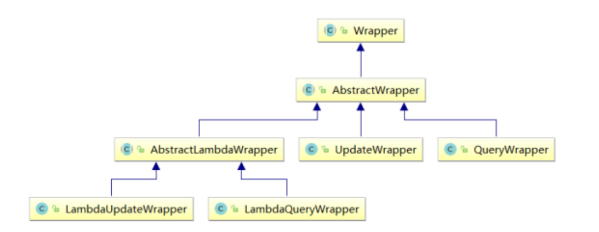
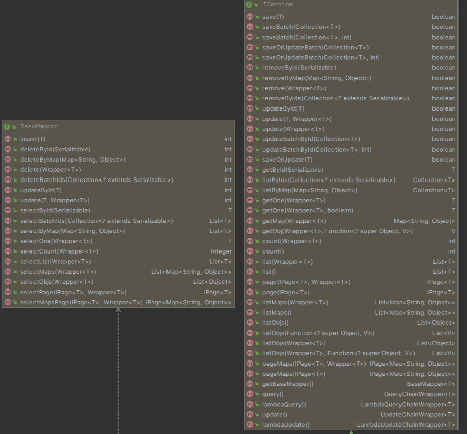

# MyBatis及MyBatisPlus学习笔记

> 额，我刚发现老师的笔记里都写了，算了，我再自己写一遍吧，感觉写了印象更深刻。

## MyBatis

暂无

## MyBatis-Plus

> MyBatis-Plus有2套API，一套是Mapper(接口少)，一套是Service(接口多,且包含了Mapper方法，只不过名字不一样)

### BaseMapper接口常用方法汇总

~~~java
public interface BaseMapper<T> extends Mapper<T> {

    /**
     * 插入一条记录
     * @param entity 实体对象
     */
    int insert(T entity);

    /**
     * 根据 ID 删除
     * @param id 主键ID
     */
    int deleteById(Serializable id);

    /**
     * 根据实体(ID)删除
     * @param entity 实体对象
     * @since 3.4.4
     */
    int deleteById(T entity);

    /**
     * 根据 columnMap 条件，删除记录
     * @param columnMap 表字段 map 对象
     */
    int deleteByMap(@Param(Constants.COLUMN_MAP) Map<String, Object> columnMap);

    /**
     * 根据 entity 条件，删除记录
     * @param queryWrapper 实体对象封装操作类（可以为 null,里面的 entity 用于生成 where 语句）
     */
    int delete(@Param(Constants.WRAPPER) Wrapper<T> queryWrapper);

    /**
     * 删除（根据ID或实体 批量删除）
     * @param idList 主键ID列表或实体列表(不能为 null 以及 empty)
     */
    int deleteBatchIds(@Param(Constants.COLL) Collection<?> idList);

    /**
     * 根据 ID 修改
     * @param entity 实体对象
     */
    int updateById(@Param(Constants.ENTITY) T entity);

    /**
     * 根据 whereEntity 条件，更新记录
     * @param entity        实体对象 (set 条件值,可以为 null)
     * @param updateWrapper 实体对象封装操作类（可以为 null,里面的 entity 用于生成 where 语句）
     */
    int update(@Param(Constants.ENTITY) T entity, @Param(Constants.WRAPPER) Wrapper<T> updateWrapper);

    /**
     * 根据 ID 查询
     * @param id 主键ID
     */
    T selectById(Serializable id);

    /**
     * 查询（根据ID 批量查询）
     * @param idList 主键ID列表(不能为 null 以及 empty)
     */
    List<T> selectBatchIds(@Param(Constants.COLL) Collection<? extends Serializable> idList);

    /**
     * 查询（根据 columnMap 条件）
     * @param columnMap 表字段 map 对象
     */
    List<T> selectByMap(@Param(Constants.COLUMN_MAP) Map<String, Object> columnMap);

    /**
     * 根据 entity 条件，查询一条记录
     * <p>查询一条记录，例如 qw.last("limit 1") 限制取一条记录, 注意：多条数据会报异常</p>
     * @param queryWrapper 实体对象封装操作类（可以为 null）
     */
    default T selectOne(@Param(Constants.WRAPPER) Wrapper<T> queryWrapper) {
        List<T> list = this.selectList(queryWrapper);
        // 抄自 DefaultSqlSession#selectOne
        if (list.size() == 1) {
            return list.get(0);
        } else if (list.size() > 1) {
            throw new TooManyResultsException("Expected one result (or null) to be returned by selectOne(), but found: " + list.size());
        } else {
            return null;
        }
    }

    /**
     * 根据 Wrapper 条件，判断是否存在记录
     * @param queryWrapper 实体对象封装操作类
     * @return 是否存在记录
     */
    default boolean exists(Wrapper<T> queryWrapper) {
        Long count = this.selectCount(queryWrapper);
        return null != count && count > 0;
    }

    /**
     * 根据 Wrapper 条件，查询总记录数
     * @param queryWrapper 实体对象封装操作类（可以为 null）
     */
    Long selectCount(@Param(Constants.WRAPPER) Wrapper<T> queryWrapper);

    /**
     * 根据 entity 条件，查询全部记录
     * @param queryWrapper 实体对象封装操作类（可以为 null）
     */
    List<T> selectList(@Param(Constants.WRAPPER) Wrapper<T> queryWrapper);

    /**
     * 根据 Wrapper 条件，查询全部记录
     * @param queryWrapper 实体对象封装操作类（可以为 null）
     */
    List<Map<String, Object>> selectMaps(@Param(Constants.WRAPPER) Wrapper<T> queryWrapper);

    /**
     * 根据 Wrapper 条件，查询全部记录
     * <p>注意： 只返回第一个字段的值</p>
     * @param queryWrapper 实体对象封装操作类（可以为 null）
     */
    List<Object> selectObjs(@Param(Constants.WRAPPER) Wrapper<T> queryWrapper);

    /**
     * 根据 entity 条件，查询全部记录（并翻页）
     * @param page         分页查询条件（可以为 RowBounds.DEFAULT）
     * @param queryWrapper 实体对象封装操作类（可以为 null）
     */
    <P extends IPage<T>> P selectPage(P page, @Param(Constants.WRAPPER) Wrapper<T> queryWrapper);

    /**
     * 根据 Wrapper 条件，查询全部记录（并翻页）
     * @param page         分页查询条件
     * @param queryWrapper 实体对象封装操作类
     */
    <P extends IPage<Map<String, Object>>> P selectMapsPage(P page, @Param(Constants.WRAPPER) Wrapper<T> queryWrapper);
}
~~~

#### select——查询

##### selectList

`UserMapper.java`：

~~~java
@Repository
//强迫症，不想看到红线的解决方法
public interface UserMapper extends BaseMapper<User> {
    //泛型就是操作的实体类的类型
}
~~~

测试类：

~~~java
@SpringBootTest
public class MyBatisPlusTest {
    @Autowired
    private UserMapper userMapper;
    //报红线，其实没事

    @Test
    public void testSelectList(){
        //通过条件构造器查询一个list集合,若没有条件，则可以设置参数为null
        List<User> list = userMapper.selectList(null);
        list.forEach(System.out::println);
    }
}
~~~

##### selectById

~~~java
@Test
public void testSelectById(){
    //根据id查询用户信息
    //SELECT id,name,age,email FROM user WHERE id=?
    User user = userMapper.selectById(1L);
    System.out.println("user:" + user);
}
~~~

##### selectBatchIds

~~~java
@Test
public void testSelectBatchIds(){
    //根据多个id查询多个用户信息
    //SELECT id,name,age,email FROM user WHERE id IN ( ? , ? , ? )
    List<Long> list = Arrays.asList(1L, 2L, 3L);
    List<User> users = userMapper.selectBatchIds(list);
    users.forEach(System.out::println);
}
~~~

##### selectByMap

~~~java
@Test
public void testSelectByMap(){
    //根据map集合中的条件查询用户信息
    //SELECT id,name,age,email FROM user WHERE name = ? AND age = ?
    Map<String,Object> map = new HashMap<>();
    map.put("name","Jack");
    map.put("age",20);
    List<User> users = userMapper.selectByMap(map);
    users.forEach(System.out::println);
}
~~~


#### insert——插入

~~~java
@Test
public void testInsert(){
    //实现新增用户信息
    //INSERT INTO user(id,name,age,email) VALUES(?,?,?,?)
    User user = new User();
    user.setName("李白");
    user.setAge(52);
    user.setEmail("1018457683@qq.com");
    int result = userMapper.insert(user);
    System.out.println("result:" + result);
    System.out.println("id:" + user.getId());   
    //id对象自动生成(mybatis-plus的id默认使用雪花算法生成的)
}
~~~

#### delete——删除

##### deleteById

~~~java
@Test
public void testDeleteById(){
    //通过id删除用户信息
    //DELETE FROM user WHERE id=?
    int result = userMapper.deleteById(1706318635956424706L);
    System.out.println(result);
}
~~~

##### deleteByMap

~~~java
@Test
public void testDeleteByMap(){
    //mybatis的底层就是通过map进行传参的
    //根据map集合中所设置的条件删除用户信息
    //条件是【并】的关系
    //DELETE FROM user WHERE name = ? AND age = ?  【and！！并的关系】
    HashMap<String , Object> map = new HashMap<>();
    map.put("name","张三");
    map.put("age","23");
    int result = userMapper.deleteByMap(map);
    System.out.println(result);
}
~~~

##### deleteBatchIds

~~~java
@Test
public void testDeleteBatchIds(){
    //通过多个id实现批量删除
    //DELETE FROM user WHERE id IN ( ? , ? , ? )
    List<Long> list = Arrays.asList(1L, 2L, 3L);
    int result = userMapper.deleteBatchIds(list);
    System.out.println(result);
}
~~~

#### update——修改

##### updateById

~~~java
@Test
public void testUpdate(){
    //根据id修改用户信息
    // UPDATE user SET name=?, email=? WHERE id=?
    User user = new User();
    user.setId(4L);
    user.setName("李四");
    user.setEmail("lisi@gmail.com");
    //如果传入的某个参数是null不会修改对应字段的
    //age没有设置，他也没有修改age字段，仍是之前的值
    int result = userMapper.updateById(user);
    System.out.println(result);
}
~~~

### IService接口常用方法汇总

> 暂无

### 自定义功能

#### 提供通用的mapper

* 在resouces包下新建`mapper`包(包名叫mapper的话，就是默认配置了)

* 在`mapper`包下创建`UserMapper`文件

  ~~~xml
  <?xml version="1.0" encoding="UTF-8" ?>
  <!DOCTYPE mapper
          PUBLIC "-//mybatis.org//DTD Mapper 3.0//EN"
          "http://mybatis.org/dtd/mybatis-3-mapper.dtd">
  <mapper namespace="com.atguigu.mybatisplus.mapper.UserMapper">
      <!--selectMapById-->
      <select id="selectMapById" resultType="map">
          select id,name,age,email from user where id = #{id}
      </select>
  </mapper>
  ~~~

* 测试类：

  ~~~java
  @Test
  public void testZidingyi(){
      //select id,name,age,email from user where id = ?
      Map<String, Object> map = userMapper.selectMapById(1L);
      System.out.println(map);
  }
  ~~~

#### 提供通用的service

##### 举例1：查询总记录数

* 新建service包及下面的impl实现包

  ~~~java
  //UserService
  @Repository
  public interface UserService extends IService<User> {
  }
  
  //UserServiceImpl
  //UserService接口继承了IService接口，可以直接使用该接口中的默认方法
  //public class UserServiceImpl implements UserService {
  //这样写我们既能继承通用service所实现的功能，也能使用自定义的功能
  @Service
  public class UserServiceImpl extends ServiceImpl<UserMapper, User> implements UserService {
  }
  ~~~

* 添加测试类

  ~~~java
  @SpringBootTest
  public class MyBatisPlusServiceTest {
      @Autowired
      //报错不用管，没问题
      private UserService userService;
  
      @Test
      public void testGetCount(){
          //查询总记录数
          //SELECT COUNT( * ) AS total FROM user
          long count = userService.count();
          System.out.println("总记录数:" + count);
      }
  }
  ~~~

##### 举例2：批量添加功能

~~~java
@Test
public void testSaveBatch(){
    //INSERT INTO user ( id, name, age ) VALUES ( ?, ?, ? )
    List<User> list = new ArrayList<>();
    for (int i = 0; i < 10; i++) {
        User user = new User();
        user.setName("ybc" + i);
        user.setAge(20 + i);
        list.add(user);
    }
    boolean b = userService.saveBatch(list);
    System.out.println(b);
}
~~~

### 条件构造器Wrapper



* Wrapper ： 条件构造抽象类，最顶端父类
  * AbstractWrapper ： 用于查询条件封装，生成 sql 的 where 条件
    * QueryWrapper ： 查询条件封装
    * UpdateWrapper ： Update 条件封装
    * AbstractLambdaWrapper ： 使用Lambda 语法
      * LambdaQueryWrapper ：用于Lambda语法使用的查询Wrapper
      * LambdaUpdateWrapper ： Lambda 更新封装Wrapper

#### QueryWrapper

##### 组装查询条件

~~~java
@Repository
//强迫症，不想看到红线的解决方法
//泛型就是操作的实体类的类型
public interface UserMapper extends BaseMapper<User> {
}
~~~


~~~java
@Test
public void test01(){
    //查询用户名包含a，年龄在20-30之间，邮箱信息不为null的用户信息
    QueryWrapper<User> queryWrapper = new QueryWrapper<>();
    //column写的不是实体类中的属性名，而是数据库中的字段名
    //SELECT uid AS id,user_name AS name,age,email,is_deleted FROM t_user WHERE 	    is_deleted=0 AND
    // (user_name LIKE ? AND age BETWEEN ? AND ? AND email IS NOT NULL)
    queryWrapper
        .like("user_name","a")
        .between("age",20,30)
        .isNotNull("email");
    List<User> list = userMapper.selectList(queryWrapper);
    list.forEach(System.out::println);
}
~~~


### 常用注解

#### @NoArgsConstructor

`@NoArgsConstructor`在类上使用，这个注解可以生成**无参**构造方法

#### @AllArgsConstructor

`@AllArgsConstructor`在类上使用，这个注解可以生成**全参**构造方法

#### @Getter

生成getter方法

#### @Setter

生成setter方法

#### @EqualsAndHashCode

此注解会生成equals(Object other) 和 hashCode()方法。

#### @Data

```
@Data = @NoArgsConstructor + @Getter + @Setter + @EqualsAndHashCode
注意：没有有参构造！！！！
```

> 只添加@Data注解时，查看class文件发现只有无参构造方法，添加@AllArgsConstructor和@NoArgsConstructor两个，才能同时有无参和带参构造方法

#### @Mapper

在接口类上添加了@Mapper，在编译之后会生成相应的接口实现类。

使用 Mapper 接口的方式，不用写接口实现类，直接完成数据库操作，简单方便。

#### @MapperScan

如果想要每个接口都要变成实现类，那么需要在每个接口类上加上@Mapper注解，比较麻烦，解决这个问题用@MapperScan。

@MapperScan用于扫描mapper接口所在的包。

**添加位置**：是在SpringBoot启动类上面添加。

#### @TableName

[@TableName注解及属性](https://blog.csdn.net/hzwrrr/article/details/118189748)

* 用来设置实体类所对应的表名。

* @TableName 注解用来将指定的数据库表和 JavaBean 进行映射。
* 这个注解也可以用于字段

#### @TableId(设置主键映射)

* mybatis-plus只能默认将id作为主键，换成例如uid就不行了，使用@TableId注解解决此问题

* 这个注解主要用于对应数据库表的实体类中的主键属性。

##### value属性

* 指定数据表主键字段名称，不是必填的，默认为空字符串。

* 比如User类主键名叫id，而MySQL数据库主键叫uid,设置此属性可解决

  ~~~java
  @TableId(value = "uid")
  private Long id;
  ~~~

##### type属性

* 指定数据表主键类型，如：ID自增、UUID等。该属性的值是一个 IdType 枚举类型，默认为 IdType.NONE。

* MyBatis-Plus默认生成主键的策略就是雪花算法，我们不仅要在数据库中设置主键递增，也要在代码中设置，否则无法递增，仍是雪花算法。

  ~~~java
  @TableId(value = "uid" ,type= IdType.AUTO)
  private Long id;
  ~~~

#### @TableField(设置普通字段映射)

mybatis-plus里面有一个默认配置，可以自动将下划线转换为相应的驼峰

* 如果实体类中的属性名和字段名不一致的情况，会出现什么问题呢？
  * 情况一：若实体类中的属性使用的是驼峰命名风格，而表中的字段使用的是下划线命名风格。例如实体类属性userName，表中字段user_name此时MyBatis-Plus会自动将下划线命名风格转化为驼峰命名风格
    相当于在MyBatis中配置
  * 情况二：若实体类中的属性和表中的字段不满足情况一，例如实体类属性name，表中字段username
    此时需要在实体类属性上使用@TableField("username")设置属性所对应的字段名

#### @TableLogic(逻辑删除)

* 物理删除：真实删除，将对应数据从数据库中删除，之后查询不到此条被删除的数据
* 逻辑删除：假删除，将对应数据中代表是否被删除字段的状态修改为“被删除状态”，之后在数据库
  中仍旧能看到此条数据记录

使用场景：可以进行数据恢复

### 博文

[关于mybatis-plus中Service和Mapper的分析](https://zhuanlan.zhihu.com/p/114451975)

在后端开发过程中，如果有用到mybatis-plus，肯定会发现在其内部存在着两种数据库操作接口，Iservice和BaseMapper，如果只是用增删改查会发现两者的功能是一致的，除了方法名称有所不同，其他的基本相似。


这样看，是不是很神奇，我们继承的ServiceImpl依旧实现了BaseMapper接口和Iservice接口，这就感觉有点啰嗦了，明明我们单独写了RestDeptMapper，并且继承了BaseMapper，现在ServiceImpl还是实现了BaseMapper，那我直接一个Service用下来不就行了，创建两套类，功能相似，还容易混乱，代码结构冗余。

本着“存在即合理”的理念，我们对比一下两个接口的方法。



果然，Service简直是BaseMapper的大扩充，不但包含了所有基本方法，还加入了很多批处理功能。

> mapper 有的 IService都有 mapper没有的 IService也有

#### Service CRUD 接口

说明:

- 通用 Service CRUD 封装[IService](https://link.zhihu.com/?target=https%3A//gitee.com/baomidou/mybatis-plus/blob/3.0/mybatis-plus-extension/src/main/java/com/baomidou/mybatisplus/extension/service/IService.java)接口，进一步封装 CRUD 采用 `get 查询单行``remove 删除``list 查询集合``page 分页` 前缀命名方式区分 `Mapper` 层避免混淆，
- 泛型 `T` 为任意实体对象
- 建议如果存在自定义通用 Service 方法的可能，请创建自己的 `IBaseService` 继承 `Mybatis-Plus` 提供的基类
- 对象 `Wrapper` 为 [条件构造器](https://link.zhihu.com/?target=https%3A//mp.baomidou.com/guide/wrapper.html)

#### Mapper CRUD 接口

说明:

- 通用 CRUD 封装[BaseMapper](https://link.zhihu.com/?target=https%3A//gitee.com/baomidou/mybatis-plus/blob/3.0/mybatis-plus-core/src/main/java/com/baomidou/mybatisplus/core/mapper/BaseMapper.java)接口，为 `Mybatis-Plus` 启动时自动解析实体表关系映射转换为 `Mybatis` 内部对象注入容器
- 泛型 `T` 为任意实体对象
- 参数 `Serializable` 为任意类型主键 `Mybatis-Plus` 不推荐使用复合主键约定每一张表都有自己的唯一 `id` 主键
- 对象 `Wrapper` 为 [条件构造器](https://link.zhihu.com/?target=https%3A//mp.baomidou.com/guide/wrapper.html)

最后本文还是比较水的，只是简单的看了一下结构而已，没有太多的深入，总结一下，以我平时粘贴复制的经验来看，Service虽然加入了数据库的操作，但还是以业务功能为主，而**更加复杂的SQL查询，还是要靠Mapper对应的XML文件里去编写SQL语句**。

#### mybatis-plus中 自定义功能(如继承baseMapper的mapper)和wrapper(条件构造器)的区别

在mybatis-plus中，自定义功能和Wrapper（条件构造器）是两个不同的概念，它们有各自的使用场景和优势。

* 自定义功能（自定义BaseMapper）主要是指在BaseMapper或IService的基础上添加一些通用的查询、插入、更新、删除等操作，这样在不同的Mapper中就可以共享这些通用的操作，避免重复编写代码。这种方式的主要优势在于可以**将一些常用的操作封装起来**，提高代码的可重用性和可维护性。

* 而Wrapper（条件构造器）主要是用于**构建查询条件**，它可以通过链式编程的方式来创建复杂的查询条件，使得代码更加简洁和易读。Wrapper的优势在于可以方便地创建复杂的查询条件，避免了手动拼接SQL语句的繁琐和易错性。

因此，自定义功能和Wrapper的区别在于它们的使用场景和目的不同。自定义功能主要用于封装通用的操作，提高代码的可重用性和可维护性；而Wrapper主要用于构建查询条件，使得代码更加简洁和易读。在实际开发中，可以根据具体的需求和情况选择使用哪种方式。