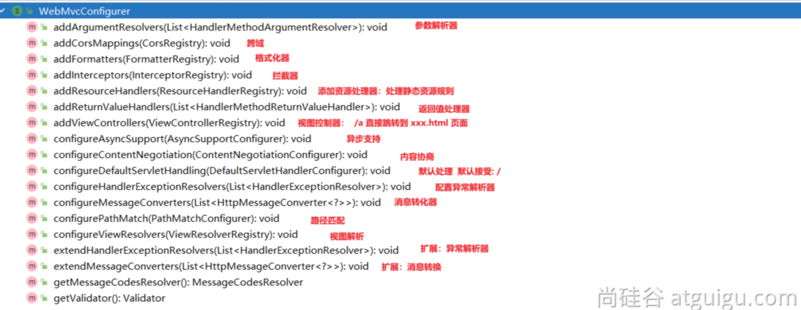

# 02-SpringBoot3Web开发

> SpringBoot的Web开发能力，由SpringMVC提供。

## WebMvcAutoConfiguration原理

### 生效条件

~~~java
@AutoConfiguration(after = { DispatcherServletAutoConfiguration.class, TaskExecutionAutoConfiguration.class,ValidationAutoConfiguration.class }) 
//在这些自动配置之后
@ConditionalOnWebApplication(type = Type.SERVLET)
//如果是web应用就生效，类型SERVLET、REACTIVE 响应式web
@ConditionalOnClass({ Servlet.class, DispatcherServlet.class, WebMvcConfigurer.class })
@ConditionalOnMissingBean(WebMvcConfigurationSupport.class) 
//容器中没有这个Bean，才生效。默认就是没有
@AutoConfigureOrder(Ordered.HIGHEST_PRECEDENCE + 10)
//优先级
@ImportRuntimeHints(WebResourcesRuntimeHints.class)
public class WebMvcAutoConfiguration { }
~~~

### 效果

* 放了两个Filter：

1. *  `HiddenHttpMethodFilter`；页面表单提交Rest请求（GET、POST、PUT、DELETE）

2. * `FormContentFilter`： **表单内容**Filter，只有GET（数据放URL后面）、POST（数据放请求体）请求可以携带数据，而PUT、DELETE 的请求体数据会被忽略

* 给容器中放了`WebMvcConfigurer`组件；给SpringMVC添加各种定制功能

1. * 所有的功能最终会和配置文件进行绑定

2. * WebMvcProperties： `spring.mvc`配置文件

3. * WebProperties： `spring.web`配置文件

~~~java
	@Configuration(proxyBeanMethods = false)
	@Import(EnableWebMvcConfiguration.class) //额外导入了其他配置
	@EnableConfigurationProperties({ WebMvcProperties.class, WebProperties.class })
	//开启了属性绑定
	@Order(0)
	public static class WebMvcAutoConfigurationAdapter implements WebMvcConfigurer, ServletContextAware{
        
    }
~~~

### WebMvcConfigurer接口

提供了配置SpringMVC底层的所有组件入口

### 静态资源规则源码

~~~java
@Override
public void addResourceHandlers(ResourceHandlerRegistry registry) {
    if (!this.resourceProperties.isAddMappings()) {
        logger.debug("Default resource handling disabled");
        return;
    }
    addResourceHandler(registry, this.mvcProperties.getWebjarsPathPattern(),
            "classpath:/META-INF/resources/webjars/");
    addResourceHandler(registry, this.mvcProperties.getStaticPathPattern(), (registration) -> {
        registration.addResourceLocations(this.resourceProperties.getStaticLocations());
        if (this.servletContext != null) {
            ServletContextResource resource = new ServletContextResource(this.servletContext, SERVLET_LOCATION);
            registration.addResourceLocations(resource);
        }
    });
}
~~~

* 规则一：访问： `/webjars/**`路径就去 `classpath:/META-INF/resources/webjars/`下找资源.
  * maven 导入依赖

* 规则二：访问： `/**`路径就去 静态资源默认的四个位置找资源
  * classpath:/META-INF/resources/

  * classpath:/resources/

  * classpath:/static/

  * classpath:/public/

* 规则三：**静态资源默认都有缓存规则的设置**

  * 所有缓存的设置，直接通过**配置文件**： spring.web

  * cachePeriod： 缓存周期； 多久不用找服务器要新的。 默认没有，以s为单位

  * cacheControl： HTTP缓存控制；https://developer.mozilla.org/zh-CN/docs/Web/HTTP/Caching

  * useLastModified：是否使用最后一次修改。配合HTTP Cache规则

  > 如果浏览器访问了一个静态资源 index.js，如果服务这个资源没有发生变化，下次访问的时候就可以直接让浏览器用自己缓存中的东西，而不用给服务器发请求。

  ~~~xml
  registration.setCachePeriod(getSeconds(this.resourceProperties.getCache().getPeriod()));
  registration.setCacheControl(this.resourceProperties.getCache().getCachecontrol().toHttpCacheControl());
  registration.setUseLastModified(this.resourceProperties.getCache().isUseLastModified());
  ~~~

### EnableWebMvcConfiguration 源码

~~~java
//SpringBoot 给容器中放 WebMvcConfigurationSupport 组件。
//我们如果自己放了 WebMvcConfigurationSupport 组件，Boot的WebMvcAutoConfiguration都会失效。
@Configuration(proxyBeanMethods = false)
@EnableConfigurationProperties(WebProperties.class)
public static class EnableWebMvcConfiguration extends DelegatingWebMvcConfiguration implements ResourceLoaderAware {  }
~~~

* `HandlerMapping`： 根据请求路径 ` /a` 找那个handler能处理请求

1. * `WelcomePageHandlerMapping`： 

1. 1. * 访问 `/**`路径下的所有请求，都在以前**四个静态资源路径**下找，欢迎页也一样

   2. * 找`index.html`：只要静态资源的位置有一个 `index.html`页面，项目启动默认访问

### 为什么容器中放一个WebMvcConfigurer就能配置底层行为

* `WebMvcAutoConfiguration`是一个自动配置类，它里面有一个 EnableWebMvcConfiguration

* EnableWebMvcConfiguration继承与 DelegatingWebMvcConfiguration，这两个都生效

* DelegatingWebMvcConfiguration利用 DI 把容器中 所有 WebMvcConfigurer 注入进来

* 别人调用 `DelegatingWebMvcConfiguration` 的方法配置底层规则，而它调用所有 WebMvcConfigurer的配置底层方法。

###  WebMvcConfigurationSupport

提供了很多的默认设置。
判断系统中是否有相应的类：如果有，就加入相应的HttpMessageConverter

~~~java
jackson2Present = ClassUtils.isPresent("com.fasterxml.jackson.databind.ObjectMapper", classLoader) &&
				ClassUtils.isPresent("com.fasterxml.jackson.core.JsonGenerator", classLoader);
jackson2XmlPresent = ClassUtils.isPresent("com.fasterxml.jackson.dataformat.xml.XmlMapper", classLoader);
jackson2SmilePresent = ClassUtils.isPresent("com.fasterxml.jackson.dataformat.smile.SmileFactory", classLoader);
~~~

## Web场景

### 自动配置

* 整合web场景

~~~xml
        <dependency>
            <groupId>org.springframework.boot</groupId>
            <artifactId>spring-boot-starter-web</artifactId>
        </dependency>
~~~

* 引入了 autoconfigure功能
* `@EnableAutoConfiguration`注解使用`@Import(AutoConfigurationImportSelector.class)`批量导入组件
* 加载`META-INF/spring/org.springframework.boot.autoconfigure.AutoConfiguration.imports`文件中配置的所有组件
* 所有自动配置类如下

~~~xml
org.springframework.boot.autoconfigure.web.client.RestTemplateAutoConfiguration
org.springframework.boot.autoconfigure.web.embedded.EmbeddedWebServerFactoryCustomizerAutoConfiguration
====以下是响应式web场景和现在的没关系======
org.springframework.boot.autoconfigure.web.reactive.HttpHandlerAutoConfiguration
org.springframework.boot.autoconfigure.web.reactive.ReactiveMultipartAutoConfiguration
org.springframework.boot.autoconfigure.web.reactive.ReactiveWebServerFactoryAutoConfiguration
org.springframework.boot.autoconfigure.web.reactive.WebFluxAutoConfiguration
org.springframework.boot.autoconfigure.web.reactive.WebSessionIdResolverAutoConfiguration
org.springframework.boot.autoconfigure.web.reactive.error.ErrorWebFluxAutoConfiguration
org.springframework.boot.autoconfigure.web.reactive.function.client.ClientHttpConnectorAutoConfiguration
org.springframework.boot.autoconfigure.web.reactive.function.client.WebClientAutoConfiguration
================以上没关系=================
org.springframework.boot.autoconfigure.web.servlet.DispatcherServletAutoConfiguration
org.springframework.boot.autoconfigure.web.servlet.ServletWebServerFactoryAutoConfiguration
org.springframework.boot.autoconfigure.web.servlet.error.ErrorMvcAutoConfiguration
org.springframework.boot.autoconfigure.web.servlet.HttpEncodingAutoConfiguration
org.springframework.boot.autoconfigure.web.servlet.MultipartAutoConfiguration
org.springframework.boot.autoconfigure.web.servlet.WebMvcAutoConfiguration
~~~

* 绑定了配置文件的一堆配置项
  * SpringMVC的所有配置 spring.mvc
  * Web场景通用配置 spring.web
  * 文件上传配置 spring.servlet.multipart
  * 服务器的配置 server: 比如：编码方式

### 默认效果

默认配置：

* 包含了 ContentNegotiatingViewResolver 和 BeanNameViewResolver 组件，方便视图解析

* 默认的静态资源处理机制： 静态资源放在 static 文件夹下即可直接访问

* 自动注册了 Converter,GenericConverter,Formatter组件，适配常见数据类型转换和格式化需求

* 支持 HttpMessageConverters，可以方便返回json等数据类型

* 注册 MessageCodesResolver，方便国际化及错误消息处理

* 支持 静态 index.html

* 自动使用`ConfigurableWebBindingInitializer`，实现消息处理、数据绑定、类型转化、数据校验等功能

> **重要：**
>
> - *如果想保持* **boot mvc 的默认配置**，并且自定义更多的 mvc 配置，如：***interceptors***,**formatters**,**view controllers** *等。可以使用**@Configuration**注解添加一个* *WebMvcConfigurer* *类型的配置类，并不要标注* **@EnableWebMvc**
> - 如果想保持 boot mvc 的默认配置，但要自定义核心组件实例，比如：**RequestMappingHandlerMapping**, RequestMappingHandlerAdapter**, 或**ExceptionHandlerExceptionResolver，给容器中放一个WebMvcRegistrations组件即可
> - *如果想全面接管 Spring MVC，**@Configuration**标注一个配置类，并加上* **@EnableWebMvc**注解，实现**WebMvcConfigurer**接口

## 静态资源

### 默认规则

#### 静态资源映射

静态资源映射规则在`WebMvcAutoConfiguration`中进行了定义：

* /webjars/** 的所有路径 资源都在 classpath:/META-INF/resources/webjars/

* /** 的所有路径 资源都在 classpath:/META-INF/resources/、classpath:/resources/、classpath:/static/、classpath:/public/

* 所有静态资源都定义了缓存规则。【浏览器访问过一次，就会缓存一段时间】，但此功能参数无默认值

1. * period： 缓存间隔。 默认 0S；

2. * cacheControl：缓存控制。 默认无；

3. * useLastModified：是否使用lastModified头。 默认 false；

#### 静态资源缓存

如前面所述

* 所有静态资源都定义了缓存规则。【浏览器访问过一次，就会缓存一段时间】，但此功能参数无默认值

1. - period： 缓存间隔。 默认 0S；

2. - cacheControl：缓存控制。 默认无；

3. - useLastModified：是否使用lastModified头。 默认 false；

#### 欢迎页

欢迎页规则在 WebMvcAutoConfiguration 中进行了定义：

* 在**静态资源**目录下找 index.html

* 没有就在 templates下找index模板页

#### Favicon

* 在静态资源目录下找 favicon.ico

#### 缓存实验

~~~xml
server.port=9000

#1、spring.web：
# 1.配置国际化的区域信息
# 2.静态资源策略(开启、处理链、缓存)

#开启静态资源映射规则
spring.web.resources.add-mappings=true

#设置缓存
#spring.web.resources.cache.period=3600
##缓存详细合并项控制，覆盖period配置：
## 浏览器第一次请求服务器，服务器告诉浏览器此资源缓存7200秒，7200秒以内的所有此资源访问不用发给服务器请求，7200秒以后发请求给服务器
spring.web.resources.cache.cachecontrol.max-age=7200
#使用资源 last-modified 时间，来对比服务器和浏览器的资源是否相同没有变化。相同返回 304
spring.web.resources.cache.use-last-modified=true
~~~

### 自定义静态资源规则

> 自定义静态资源路径、自定义缓存规则

#### 配置方式

`spring.mvc`： 静态资源访问前缀路径

`spring.web`：

- 静态资源目录
- 静态资源缓存策略

~~~xml
#1、spring.web：
# 1.配置国际化的区域信息
# 2.静态资源策略(开启、处理链、缓存)

#开启静态资源映射规则
spring.web.resources.add-mappings=true

#设置缓存
spring.web.resources.cache.period=3600
##缓存详细合并项控制，覆盖period配置：
## 浏览器第一次请求服务器，服务器告诉浏览器此资源缓存7200秒，7200秒以内的所有此资源访问不用发给服务器请求，7200秒以后发请求给服务器
spring.web.resources.cache.cachecontrol.max-age=7200
## 共享缓存
spring.web.resources.cache.cachecontrol.cache-public=true
#使用资源 last-modified 时间，来对比服务器和浏览器的资源是否相同没有变化。相同返回 304
spring.web.resources.cache.use-last-modified=true

#自定义静态资源文件夹位置
spring.web.resources.static-locations=classpath:/a/,classpath:/b/,classpath:/static/

#2、 spring.mvc
## 2.1. 自定义webjars路径前缀
spring.mvc.webjars-path-pattern=/wj/**
## 2.2. 静态资源访问路径前缀
spring.mvc.static-path-pattern=/static/**
~~~

#### 代码方式

- 容器中只要有一个 WebMvcConfigurer 组件。配置的底层行为都会生效
- @EnableWebMvc //禁用boot的默认配置

~~~java
@Configuration //这是一个配置类
public class MyConfig implements WebMvcConfigurer {

    @Override
    public void addResourceHandlers(ResourceHandlerRegistry registry) {
        //保留以前规则
        //自己写新的规则。
        registry.addResourceHandler("/static/**")
                .addResourceLocations("classpath:/a/","classpath:/b/")
                .setCacheControl(CacheControl.maxAge(1180, TimeUnit.SECONDS));
    }
}
~~~

~~~java
@Configuration //这是一个配置类,给容器中放一个 WebMvcConfigurer 组件，就能自定义底层
public class MyConfig  /*implements WebMvcConfigurer*/ {

    @Bean
    public WebMvcConfigurer webMvcConfigurer(){
        return new WebMvcConfigurer() {
            @Override
            public void addResourceHandlers(ResourceHandlerRegistry registry) {
                registry.addResourceHandler("/static/**")
                        .addResourceLocations("classpath:/a/", "classpath:/b/")
                        .setCacheControl(CacheControl.maxAge(1180, TimeUnit.SECONDS));
            }
        };
    }

}
~~~

