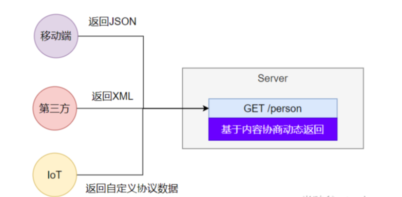
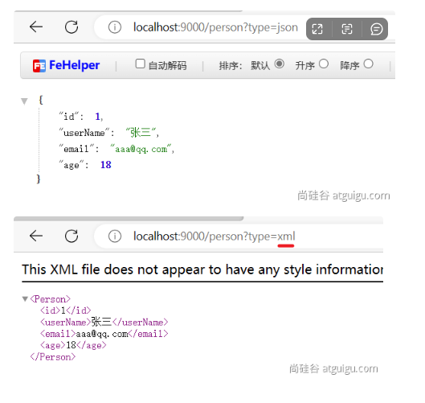
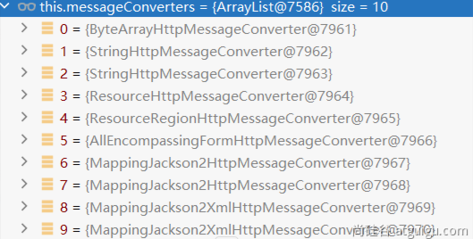
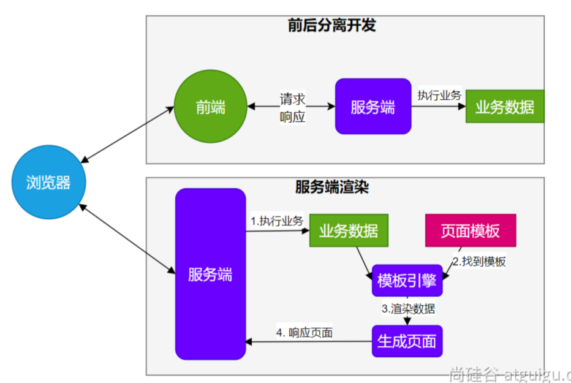
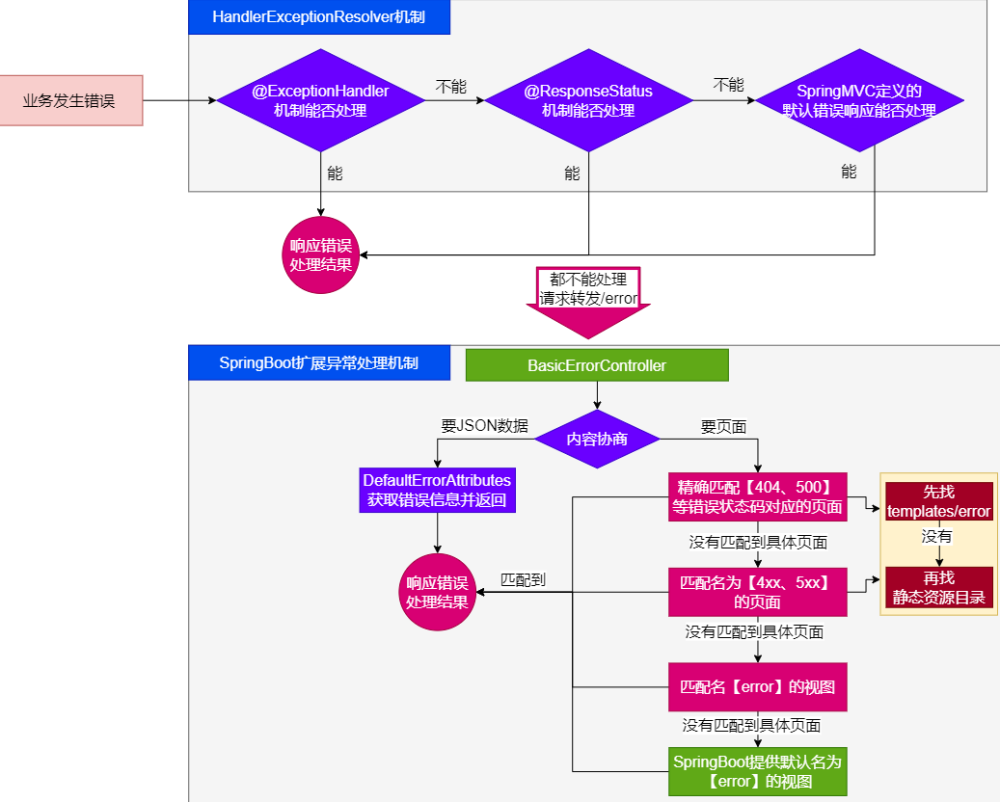
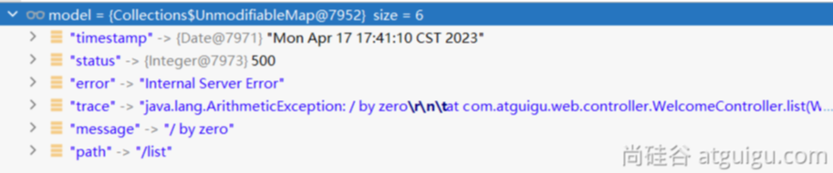
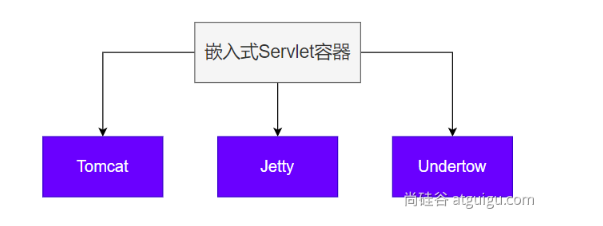

# 02-SpringBoot3Web开发

> SpringBoot的Web开发能力，由SpringMVC提供。

## WebMvcAutoConfiguration原理

### 生效条件

~~~java
@AutoConfiguration(after = { DispatcherServletAutoConfiguration.class, TaskExecutionAutoConfiguration.class,ValidationAutoConfiguration.class }) 
//在这些自动配置之后
@ConditionalOnWebApplication(type = Type.SERVLET)
//如果是web应用就生效，类型SERVLET、REACTIVE 响应式web
@ConditionalOnClass({ Servlet.class, DispatcherServlet.class, WebMvcConfigurer.class })
@ConditionalOnMissingBean(WebMvcConfigurationSupport.class) 
//容器中没有这个Bean，才生效。默认就是没有
@AutoConfigureOrder(Ordered.HIGHEST_PRECEDENCE + 10)
//优先级
@ImportRuntimeHints(WebResourcesRuntimeHints.class)
public class WebMvcAutoConfiguration { }
~~~

### 效果

* 放了两个Filter：

1. *  `HiddenHttpMethodFilter`；页面表单提交Rest请求（GET、POST、PUT、DELETE）

2. * `FormContentFilter`： **表单内容**Filter，只有GET（数据放URL后面）、POST（数据放请求体）请求可以携带数据，而PUT、DELETE 的请求体数据会被忽略

* 给容器中放了`WebMvcConfigurer`组件；给SpringMVC添加各种定制功能

1. * 所有的功能最终会和配置文件进行绑定

2. * WebMvcProperties： `spring.mvc`配置文件

3. * WebProperties： `spring.web`配置文件

~~~java
	@Configuration(proxyBeanMethods = false)
	@Import(EnableWebMvcConfiguration.class) //额外导入了其他配置
	@EnableConfigurationProperties({ WebMvcProperties.class, WebProperties.class })
	//开启了属性绑定
	@Order(0)
	public static class WebMvcAutoConfigurationAdapter implements WebMvcConfigurer, ServletContextAware{
        
    }
~~~

### WebMvcConfigurer接口

提供了配置SpringMVC底层的所有组件入口


### 静态资源规则源码

~~~java
@Override
public void addResourceHandlers(ResourceHandlerRegistry registry) {
    if (!this.resourceProperties.isAddMappings()) {
        logger.debug("Default resource handling disabled");
        return;
    }
    addResourceHandler(registry, this.mvcProperties.getWebjarsPathPattern(),
            "classpath:/META-INF/resources/webjars/");
    addResourceHandler(registry, this.mvcProperties.getStaticPathPattern(), (registration) -> {
        registration.addResourceLocations(this.resourceProperties.getStaticLocations());
        if (this.servletContext != null) {
            ServletContextResource resource = new ServletContextResource(this.servletContext, SERVLET_LOCATION);
            registration.addResourceLocations(resource);
        }
    });
}
~~~

* 规则一：访问： `/webjars/**`路径就去 `classpath:/META-INF/resources/webjars/`下找资源.

  * maven 导入依赖

* 规则二：访问： `/**`路径就去 静态资源默认的四个位置找资源
  * classpath:/META-INF/resources/

  * classpath:/resources/

  * classpath:/static/

  * classpath:/public/

* 规则三：**静态资源默认都有缓存规则的设置**

  * 所有缓存的设置，直接通过**配置文件**： spring.web

  * cachePeriod： 缓存周期； 多久不用找服务器要新的。 默认没有，以s为单位

  * cacheControl： HTTP缓存控制；https://developer.mozilla.org/zh-CN/docs/Web/HTTP/Caching

  * useLastModified：是否使用最后一次修改。配合HTTP Cache规则

  > 如果浏览器访问了一个静态资源 index.js，如果服务这个资源没有发生变化，下次访问的时候就可以直接让浏览器用自己缓存中的东西，而不用给服务器发请求。

  ~~~xml
  registration.setCachePeriod(getSeconds(this.resourceProperties.getCache().getPeriod()));
  registration.setCacheControl(this.resourceProperties.getCache().getCachecontrol().toHttpCacheControl());
  registration.setUseLastModified(this.resourceProperties.getCache().isUseLastModified());
  ~~~

### EnableWebMvcConfiguration 源码

~~~java
//SpringBoot 给容器中放 WebMvcConfigurationSupport 组件。
//我们如果自己放了 WebMvcConfigurationSupport 组件，Boot的WebMvcAutoConfiguration都会失效。
@Configuration(proxyBeanMethods = false)
@EnableConfigurationProperties(WebProperties.class)
public static class EnableWebMvcConfiguration extends DelegatingWebMvcConfiguration implements ResourceLoaderAware {  }
~~~

* `HandlerMapping`： 根据请求路径 ` /a` 找那个handler能处理请求

1. * `WelcomePageHandlerMapping`： 

1. 1. * 访问 `/**`路径下的所有请求，都在以前**四个静态资源路径**下找，欢迎页也一样

   2. * 找`index.html`：只要静态资源的位置有一个 `index.html`页面，项目启动默认访问

### 为什么容器中放一个WebMvcConfigurer就能配置底层行为

* `WebMvcAutoConfiguration`是一个自动配置类，它里面有一个`EnableWebMvcConfiguration`
* `EnableWebMvcConfiguration`继承于 `DelegatingWebMvcConfiguration`，这两个都生效
* `DelegatingWebMvcConfiguration`利用 DI 把容器中 所有 `WebMvcConfigurer `注入进来
* 别人调用 `DelegatingWebMvcConfiguration` 的方法配置底层规则，而它调用所有 `WebMvcConfigurer`的配置底层方法。

> 专门写了一个授权类，然后让WebMvcAutoConfiguration类去继承，在这个delegate类中注入所有的webMvcConfiguration配置类，然后让所有的配置类生效

###  WebMvcConfigurationSupport

提供了很多的默认设置。
判断系统中是否有相应的类：如果有，就加入相应的HttpMessageConverter

~~~java
jackson2Present = ClassUtils.isPresent("com.fasterxml.jackson.databind.ObjectMapper", classLoader) &&
				ClassUtils.isPresent("com.fasterxml.jackson.core.JsonGenerator", classLoader);
jackson2XmlPresent = ClassUtils.isPresent("com.fasterxml.jackson.dataformat.xml.XmlMapper", classLoader);
jackson2SmilePresent = ClassUtils.isPresent("com.fasterxml.jackson.dataformat.smile.SmileFactory", classLoader);
~~~

## Web场景

### 自动配置

* 整合web场景

~~~xml
        <dependency>
            <groupId>org.springframework.boot</groupId>
            <artifactId>spring-boot-starter-web</artifactId>
        </dependency>
~~~

* 引入了 autoconfigure功能
* `@EnableAutoConfiguration`注解使用`@Import(AutoConfigurationImportSelector.class)`批量导入组件
* 加载`META-INF/spring/org.springframework.boot.autoconfigure.AutoConfiguration.imports`文件中配置的所有组件
* 所有自动配置类如下

~~~xml
org.springframework.boot.autoconfigure.web.client.RestTemplateAutoConfiguration
org.springframework.boot.autoconfigure.web.embedded.EmbeddedWebServerFactoryCustomizerAutoConfiguration
====以下是响应式web场景和现在的没关系======
org.springframework.boot.autoconfigure.web.reactive.HttpHandlerAutoConfiguration
org.springframework.boot.autoconfigure.web.reactive.ReactiveMultipartAutoConfiguration
org.springframework.boot.autoconfigure.web.reactive.ReactiveWebServerFactoryAutoConfiguration
org.springframework.boot.autoconfigure.web.reactive.WebFluxAutoConfiguration
org.springframework.boot.autoconfigure.web.reactive.WebSessionIdResolverAutoConfiguration
org.springframework.boot.autoconfigure.web.reactive.error.ErrorWebFluxAutoConfiguration
org.springframework.boot.autoconfigure.web.reactive.function.client.ClientHttpConnectorAutoConfiguration
org.springframework.boot.autoconfigure.web.reactive.function.client.WebClientAutoConfiguration
================以上没关系=================
org.springframework.boot.autoconfigure.web.servlet.DispatcherServletAutoConfiguration
org.springframework.boot.autoconfigure.web.servlet.ServletWebServerFactoryAutoConfiguration
org.springframework.boot.autoconfigure.web.servlet.error.ErrorMvcAutoConfiguration
org.springframework.boot.autoconfigure.web.servlet.HttpEncodingAutoConfiguration
org.springframework.boot.autoconfigure.web.servlet.MultipartAutoConfiguration
org.springframework.boot.autoconfigure.web.servlet.WebMvcAutoConfiguration
~~~

* 绑定了配置文件的一堆配置项
  * SpringMVC的所有配置 spring.mvc
  * Web场景通用配置 spring.web
  * 文件上传配置 spring.servlet.multipart
  * 服务器的配置 server: 比如：编码方式

### 默认效果

默认配置：

* 包含了 ContentNegotiatingViewResolver 和 BeanNameViewResolver 组件，方便视图解析

* 默认的静态资源处理机制： 静态资源放在 static 文件夹下即可直接访问

* 自动注册了 Converter,GenericConverter,Formatter组件，适配常见数据类型转换和格式化需求

* 支持 HttpMessageConverters，可以方便返回json等数据类型

* 注册 MessageCodesResolver，方便国际化及错误消息处理

* 支持 静态 index.html

* 自动使用`ConfigurableWebBindingInitializer`，实现消息处理、数据绑定、类型转化、数据校验等功能

> **重要：**
>
> - *如果想保持* **boot mvc 的默认配置**，并且自定义更多的 mvc 配置，如：***interceptors***,**formatters**,**view controllers** *等。可以使用**@Configuration**注解添加一个* *WebMvcConfigurer* *类型的配置类，并不要标注* **@EnableWebMvc**
> - 如果想保持 boot mvc 的默认配置，但要自定义核心组件实例，比如：**RequestMappingHandlerMapping**, RequestMappingHandlerAdapter**, 或**ExceptionHandlerExceptionResolver，给容器中放一个WebMvcRegistrations组件即可
> - *如果想全面接管 Spring MVC，**@Configuration**标注一个配置类，并加上* **@EnableWebMvc**注解，实现**WebMvcConfigurer**接口

## 静态资源

### 默认规则

#### 静态资源映射

静态资源映射规则在`WebMvcAutoConfiguration`中进行了定义：

* /webjars/** 的所有路径 资源都在 classpath:/META-INF/resources/webjars/

* /** 的所有路径 资源都在 classpath:/META-INF/resources/、classpath:/resources/、classpath:/static/、classpath:/public/

* 所有静态资源都定义了缓存规则。【浏览器访问过一次，就会缓存一段时间】，但此功能参数无默认值

1. * period： 缓存间隔。 默认 0S；

2. * cacheControl：缓存控制。 默认无；

3. * useLastModified：是否使用lastModified头。 默认 false；

#### 静态资源缓存

如前面所述

* 所有静态资源都定义了缓存规则。【浏览器访问过一次，就会缓存一段时间】，但此功能参数无默认值

1. - period： 缓存间隔。 默认 0S；

2. - cacheControl：缓存控制。 默认无；

3. - useLastModified：是否使用lastModified头。 默认 false；

#### 欢迎页

欢迎页规则在 WebMvcAutoConfiguration 中进行了定义：

* 在**静态资源**目录下找 index.html

* 没有就在 templates下找index模板页

#### Favicon

* 在静态资源目录下找 favicon.ico

#### 缓存实验

~~~xml
server.port=9000

#1、spring.web：
# 1.配置国际化的区域信息
# 2.静态资源策略(开启、处理链、缓存)

#开启静态资源映射规则
spring.web.resources.add-mappings=true

#设置缓存
#spring.web.resources.cache.period=3600
##缓存详细合并项控制，覆盖period配置：
## 浏览器第一次请求服务器，服务器告诉浏览器此资源缓存7200秒，7200秒以内的所有此资源访问不用发给服务器请求，7200秒以后发请求给服务器
spring.web.resources.cache.cachecontrol.max-age=7200
#使用资源 last-modified 时间，来对比服务器和浏览器的资源是否相同没有变化。相同返回 304
spring.web.resources.cache.use-last-modified=true
~~~

### 自定义静态资源规则

> 自定义静态资源路径、自定义缓存规则

#### 配置方式

`spring.mvc`： 静态资源访问前缀路径

`spring.web`：

- 静态资源目录
- 静态资源缓存策略

~~~xml
#1、spring.web：
# 1.配置国际化的区域信息
# 2.静态资源策略(开启、处理链、缓存)

#开启静态资源映射规则
spring.web.resources.add-mappings=true

#设置缓存
spring.web.resources.cache.period=3600
##缓存详细合并项控制，覆盖period配置：
## 浏览器第一次请求服务器，服务器告诉浏览器此资源缓存7200秒，7200秒以内的所有此资源访问不用发给服务器请求，7200秒以后发请求给服务器
spring.web.resources.cache.cachecontrol.max-age=7200
## 共享缓存
spring.web.resources.cache.cachecontrol.cache-public=true
#使用资源 last-modified 时间，来对比服务器和浏览器的资源是否相同没有变化。相同返回 304
spring.web.resources.cache.use-last-modified=true

#自定义静态资源文件夹位置
spring.web.resources.static-locations=classpath:/a/,classpath:/b/,classpath:/static/

#2、 spring.mvc
## 2.1. 自定义webjars路径前缀
spring.mvc.webjars-path-pattern=/wj/**
## 2.2. 静态资源访问路径前缀
spring.mvc.static-path-pattern=/static/**
~~~

#### 代码方式

- 容器中只要有一个 WebMvcConfigurer 组件。配置的底层行为都会生效
- @EnableWebMvc //禁用boot的默认配置

~~~java
@Configuration //这是一个配置类
public class MyConfig implements WebMvcConfigurer {


    @Override
    public void addResourceHandlers(ResourceHandlerRegistry registry) {
        //保留以前规则
        //自己写新的规则。
        registry.addResourceHandler("/static/**")
                .addResourceLocations("classpath:/a/","classpath:/b/")
                .setCacheControl(CacheControl.maxAge(1180, TimeUnit.SECONDS));
    }
}
~~~

~~~java
@Configuration //这是一个配置类,给容器中放一个 WebMvcConfigurer 组件，就能自定义底层
public class MyConfig  /*implements WebMvcConfigurer*/ {


    @Bean
    public WebMvcConfigurer webMvcConfigurer(){
        return new WebMvcConfigurer() {
            @Override
            public void addResourceHandlers(ResourceHandlerRegistry registry) {
                registry.addResourceHandler("/static/**")
                        .addResourceLocations("classpath:/a/", "classpath:/b/")
                        .setCacheControl(CacheControl.maxAge(1180, TimeUnit.SECONDS));
            }
        };
    }

}
~~~

## 路径匹配

> **Spring5.3** 之后加入了更多的请求路径匹配的实现策略；
>
> 以前只支持 AntPathMatcher 策略, 现在提供了 **PathPatternParser** 策略。并且可以让我们指定到底使用那种策略。

### Ant风格路径用法

Ant 风格的路径模式语法具有以下规则：

* *：表示**任意数量**的字符。

* ?：表示任意**一个字符**。

* **：表示**任意数量的目录**。

* {}：表示一个命名的模式**占位符**。

* []：表示**字符集合**，例如[a-z]表示小写字母。

例如：

* `*.html`匹配任意名称，扩展名为.html的文件。

* `/folder1/*/*.java`匹配在folder1目录下的任意两级目录下的.java文件。

- `/folder2/**/*.jsp`匹配在folder2目录下任意目录深度的.jsp文件。
- `/{type}/{id}.html`匹配任意文件名为{id}.html，在任意命名的{type}目录下的文件。

注意：Ant 风格的路径模式语法中的特殊字符需要转义，如：

- 要匹配文件路径中的星号，则需要转义为`\\*`。
- 要匹配文件路径中的问号，则需要转义为`\\?`。

### 模式切换

> #### `AntPathMatcher` 与 `PathPatternParser`
>
> - PathPatternParser 在 jmh 基准测试下，有 6~8 倍吞吐量提升，降低 30%~40%空间分配率
> - PathPatternParser 兼容 AntPathMatcher语法，并支持更多类型的路径模式
> - PathPatternParser  "***\***" **多段匹配**的支持**仅允许在模式末尾使用**(双*只能用在末尾！！)

~~~java
@GetMapping("/a*/b?/{p1:[a-f]+}")
public String hello(HttpServletRequest request, 
                    @PathVariable("p1") String path) {

    log.info("路径变量p1： {}", path);
    //获取请求路径
    String uri = request.getRequestURI();
    return uri;
}
~~~

总结： 

- 使用**默认**的路径匹配规则，是由 PathPatternParser  提供的
- 如果**路径中间**需要有 **，替换成**ant风格路径**

~~~xml
# 改变路径匹配策略：
# ant_path_matcher 老版策略；
# path_pattern_parser 新版策略；
spring.mvc.pathmatch.matching-strategy=ant_path_matcher
~~~

## 内容协商

> 一套系统适配多端数据返回



###   多端内容适配

#### 默认规则

**SpringBoot 多端内容适配**。

* 基于**请求头**内容协商：（**默认开启**）
  * 客户端向服务端发送请求，携带HTTP标准的**Accept请求头**。
    *  **Accept**: `application/json`、`text/xml`、`text/yaml`
    *  服务端根据客户端**请求头期望的数据类型**进行**动态返回**
* 基于**请求参数**内容协商：（**需要开启**）
  * 发送请求 GET /projects/spring-boot?format=json 
  * 匹配到 @GetMapping("/projects/spring-boot") 
  * 根据**参数协商**，优先返回json类型数据【**需要开启参数匹配设置**】
  * 发送请求 GET /projects/spring-boot?format=xml,优先返回 xml 类型数据

#### 效果展示

> 请求同一个接口，可以返回json和xml不同格式数据

* 引入支持写出xml内容依赖

  ~~~xml
  <dependency>
      <groupId>com.fasterxml.jackson.dataformat</groupId>
      <artifactId>jackson-dataformat-xml</artifactId>
  </dependency>
  ~~~

* 标注注解

  ~~~java
  @JacksonXmlRootElement  // 可以写出为xml文档
  @Data
  public class Person {
      private Long id;
      private String userName;
      private String email;
      private Integer age;
  }
  ~~~

* 开启基于请求参数的内容协商

  ~~~java
  # 开启基于请求参数的内容协商功能。 默认参数名：format。 默认此功能不开启
  spring.mvc.contentnegotiation.favor-parameter=true
  # 指定内容协商时使用的参数名。默认是 format
  spring.mvc.contentnegotiation.parameter-name=type
  ~~~

* 效果

  

#### 配置协商规则与支持类型

修改内容协商方式：

~~~xml
#使用参数进行内容协商
spring.mvc.contentnegotiation.favor-parameter=true  
#自定义参数名，默认为format
spring.mvc.contentnegotiation.parameter-name=myparam 
~~~

大多数 MediaType 都是开箱即用的。也可以自定义内容类型，如：

~~~xml
spring.mvc.contentnegotiation.media-types.yaml=text/yaml
~~~

### 自定义内容返回

#### 增加yaml返回支持

导入依赖：

~~~xml
<dependency>
    <groupId>com.fasterxml.jackson.dataformat</groupId>
    <artifactId>jackson-dataformat-yaml</artifactId>
</dependency>
~~~

把对象写出成YAML：

~~~java
    public static void main(String[] args) throws JsonProcessingException {
        Person person = new Person();
        person.setId(1L);
        person.setUserName("张三");
        person.setEmail("aaa@qq.com");
        person.setAge(18);

        YAMLFactory factory = new YAMLFactory().disable(YAMLGenerator.Feature.WRITE_DOC_START_MARKER);
        ObjectMapper mapper = new ObjectMapper(factory);

        String s = mapper.writeValueAsString(person);
        System.out.println(s);
    }
~~~

编写配置：

~~~xml
#新增一种媒体类型
spring.mvc.contentnegotiation.media-types.yaml=text/yaml
~~~

增加HttpMessageConverter组件，专门负责把对象写出为yaml格式：

~~~java
    @Bean
    public WebMvcConfigurer webMvcConfigurer(){
        return new WebMvcConfigurer() {
            @Override //配置一个能把对象转为yaml的messageConverter
            public void configureMessageConverters(List<HttpMessageConverter<?>> converters) {
                converters.add(new MyYamlHttpMessageConverter());
            }
        };
    }
~~~

#### 思考：如何增加其他

* 配置媒体类型支持: 
  * spring.mvc.contentnegotiation.media-types.yaml=text/yaml
* 编写对应的HttpMessageConverter，要告诉Boot这个支持的媒体类型
  * 按照3的示例
* 把MessageConverter组件加入到底层
  * 容器中放一个`WebMvcConfigurer` 组件，并配置底层的MessageConverter

#### HttpMessageConverter的示例写法

~~~java
public class MyYamlHttpMessageConverter extends AbstractHttpMessageConverter<Object> {

    private ObjectMapper objectMapper = null; //把对象转成yaml

    public MyYamlHttpMessageConverter(){
        //告诉SpringBoot这个MessageConverter支持哪种媒体类型  //媒体类型
        super(new MediaType("text", "yaml", Charset.forName("UTF-8")));
        YAMLFactory factory = new YAMLFactory()
                .disable(YAMLGenerator.Feature.WRITE_DOC_START_MARKER);
        this.objectMapper = new ObjectMapper(factory);
    }

    @Override
    protected boolean supports(Class<?> clazz) {
        //只要是对象类型，不是基本类型
        return true;
    }

    @Override  //@RequestBody
    protected Object readInternal(Class<?> clazz, HttpInputMessage inputMessage) throws IOException, HttpMessageNotReadableException {
        return null;
    }

    @Override //@ResponseBody 把对象怎么写出去
    protected void writeInternal(Object methodReturnValue, HttpOutputMessage outputMessage) throws IOException, HttpMessageNotWritableException {

        //try-with写法，自动关流
        try(OutputStream os = outputMessage.getBody()){
            this.objectMapper.writeValue(os,methodReturnValue);
        }

    }
}
~~~

### 内容协商原理-HttpMessageConverter

> * HttpMessageConverter 怎么工作？合适工作？
> * 定制 HttpMessageConverter  来实现多端内容协商
> * 编写`WebMvcConfigurer`提供的`configureMessageConverters`底层，修改底层的`MessageConverter`

##### @ResponseBody由HttpMessageConverter处理

> 标注了@ResponseBody的返回值 将会由支持它的 HttpMessageConverter写给浏览器

* 如果controller方法的返回值标注了 @ResponseBody 注解
  * 请求进来先来到`DispatcherServlet`的`doDispatch()`进行处理
  * 找到一个`HandlerAdapter`适配器。利用适配器执行目标方法
  * `RequestMappingHandlerAdapter`来执行，调用`invokeHandlerMethod()`来执行目标方法
  * 目标方法执行之前，准备好两个东西
    *  `HandlerMethodArgumentResolver`：参数解析器，确定目标方法每个参数值
    * `HandlerMethodReturnValueHandler`：返回值处理器，确定目标方法的返回值改怎么处理
  * `RequestMappingHandlerAdapter `里面的`invokeAndHandle()`真正执行目标方法
  * 目标方法执行完成，会返回返回值对象
  *  找到一个合适的返回值处理器 `HandlerMethodReturnValueHandler`
  * 最终找到`RequestResponseBodyMethodProcessor`能处理 标注了`@ResponseBody`注解的方法
  * `RequestResponseBodyMethodProcessor`调用`writeWithMessageConverters` ,利用`MessageConverter`把返回值写出去

> 上面解释：@ResponseBody由HttpMessageConverter处理

* HttpMessageConverter 会先进行内容协商

  *   遍历所有的MessageConverter看谁支持这种内容类型的数据
  *   默认MessageConverter有以下

  


  * 最终因为要json所以MappingJackson2HttpMessageConverter支持写出json
  *  jackson用ObjectMapper把对象写出去

##### WebMvcAutoConfiguration提供几种默认HttpMessageConverters

* EnableWebMvcConfiguration通过 addDefaultHttpMessageConverters添加了默认的MessageConverter；如下：
  * ByteArrayHttpMessageConverter： 支持字节数据读写
  * StringHttpMessageConverter： 支持字符串读写

  * ResourceHttpMessageConverter：支持资源读写

  * ResourceRegionHttpMessageConverter: 支持分区资源写出

  * AllEncompassingFormHttpMessageConverter：支持表单xml/json读写

  * MappingJackson2HttpMessageConverter： 支持请求响应体Json读写

默认8个：


> 系统提供默认的MessageConverter 功能有限，仅用于json或者普通返回数据。额外增加新的内容协商功能，必须增加新的HttpMessageConverter

## 模板引擎

> * 由于 SpringBoot 使用了嵌入式 Servlet 容器。所以 JSP 默认是不能使用的。
> * 如果需要服务端页面渲染，优先考虑使用 模板引擎。



模板引擎页面默认放在 src/main/resources/templates
SpringBoot 包含以下模板引擎的自动配置

* FreeMarker
* Groovy
* Thymeleaf
* Mustache

Thymeleaf官网：https://www.thymeleaf.org/ 

~~~html
<!DOCTYPE html>
<html xmlns:th="http://www.thymeleaf.org">
<head>
	<title>Good Thymes Virtual Grocery</title>
	<meta http-equiv="Content-Type" content="text/html; charset=UTF-8" />
	<link rel="stylesheet" type="text/css" media="all" th:href="@{/css/gtvg.css}" />
</head>
<body>
	<p th:text="#{home.welcome}">Welcome to our grocery store!</p>
</body
</html>
~~~

> 后面模板引擎部分我就不学了，没啥意思，笔记也就不摘抄了。

## 国际化

国际化的自动配置参照`MessageSourceAutoConfiguration`

**实现步骤**：

* Spring Boot 在类路径根下查找messages资源绑定文件。文件名为：messages.properties

* 多语言可以定义多个消息文件，命名为`messages_区域代码.properties`。如：

1. * `messages.properties`：默认

2. * `messages_zh_CN.properties`：中文环境

3. * `messages_en_US.properties`：英语环境

* 在**程序中**可以自动注入 `MessageSource`组件，获取国际化的配置项值

* 在**页面中**可以使用表达式 ` #{}`获取国际化的配置项值

~~~java
    @Autowired  //国际化取消息用的组件
    MessageSource messageSource;
    @GetMapping("/haha")
    public String haha(HttpServletRequest request){

        Locale locale = request.getLocale();
        //利用代码的方式获取国际化配置文件中指定的配置项的值
        String login = messageSource.getMessage("login", null, locale);
        return login;
    }
~~~

## 错误处理

###  默认机制

**错误处理的自动配置**都在`ErrorMvcAutoConfiguration`中，两大核心机制：

*  SpringBoot 会**自适应**处理错误，响应页面或JSON数据

* **SpringMVC的错误处理机制**依然保留，**MVC处理不了**，才会**交给boot进行处理**



* 发生错误以后，转发给/error路径，SpringBoot在底层写好一个 BasicErrorController的组件，专门处理这个请求

~~~java
	@RequestMapping(produces = MediaType.TEXT_HTML_VALUE) //返回HTML
	public ModelAndView errorHtml(HttpServletRequest request, HttpServletResponse response) {
		HttpStatus status = getStatus(request);
		Map<String, Object> model = Collections
			.unmodifiableMap(getErrorAttributes(request, getErrorAttributeOptions(request, MediaType.TEXT_HTML)));
		response.setStatus(status.value());
		ModelAndView modelAndView = resolveErrorView(request, response, status, model);
		return (modelAndView != null) ? modelAndView : new ModelAndView("error", model);
	}

	@RequestMapping  //返回 ResponseEntity, JSON
	public ResponseEntity<Map<String, Object>> error(HttpServletRequest request) {
		HttpStatus status = getStatus(request);
		if (status == HttpStatus.NO_CONTENT) {
			return new ResponseEntity<>(status);
		}
		Map<String, Object> body = getErrorAttributes(request, getErrorAttributeOptions(request, MediaType.ALL));
		return new ResponseEntity<>(body, status);
	}
~~~

错误页面是这么解析到的

~~~java
//1、解析错误的自定义视图地址
ModelAndView modelAndView = resolveErrorView(request, response, status, model);
//2、如果解析不到错误页面的地址，默认的错误页就是 error
return (modelAndView != null) ? modelAndView : new ModelAndView("error", model);
~~~

容器中专门有一个错误视图解析器

~~~java
@Bean
@ConditionalOnBean(DispatcherServlet.class)
@ConditionalOnMissingBean(ErrorViewResolver.class)
DefaultErrorViewResolver conventionErrorViewResolver() {
    return new DefaultErrorViewResolver(this.applicationContext, this.resources);
}
~~~

SpringBoot解析自定义错误页的默认规则

~~~java
	@Override
	public ModelAndView resolveErrorView(HttpServletRequest request, HttpStatus status, Map<String, Object> model) {
		ModelAndView modelAndView = resolve(String.valueOf(status.value()), model);
		if (modelAndView == null && SERIES_VIEWS.containsKey(status.series())) {
			modelAndView = resolve(SERIES_VIEWS.get(status.series()), model);
		}
		return modelAndView;
	}

	private ModelAndView resolve(String viewName, Map<String, Object> model) {
		String errorViewName = "error/" + viewName;
		TemplateAvailabilityProvider provider = this.templateAvailabilityProviders.getProvider(errorViewName,
				this.applicationContext);
		if (provider != null) {
			return new ModelAndView(errorViewName, model);
		}
		return resolveResource(errorViewName, model);
	}

	private ModelAndView resolveResource(String viewName, Map<String, Object> model) {
		for (String location : this.resources.getStaticLocations()) {
			try {
				Resource resource = this.applicationContext.getResource(location);
				resource = resource.createRelative(viewName + ".html");
				if (resource.exists()) {
					return new ModelAndView(new HtmlResourceView(resource), model);
				}
			}
			catch (Exception ex) {
			}
		}
		return null;
	}
~~~

容器中有一个默认的名为 error 的 view； 提供了默认白页功能

~~~java
@Bean(name = "error")
@ConditionalOnMissingBean(name = "error")
public View defaultErrorView() {
    return this.defaultErrorView;
}
~~~

封装了JSON格式的错误信息

~~~java
@Bean
@ConditionalOnMissingBean(value = ErrorAttributes.class, search = SearchStrategy.CURRENT)
public DefaultErrorAttributes errorAttributes() {
    return new DefaultErrorAttributes();
}
~~~

规则：

* **解析一个错误页**

1. * 如果发生了500、404、503、403 这些错误

1. 1. * 如果有**模板引擎**，默认在 `classpath:/templates/error/精确码.html`

   2. * 如果没有模板引擎，在静态资源文件夹下找  `精确码.html`

1. * 如果匹配不到`精确码.html`这些精确的错误页，就去找`5xx.html`，`4xx.html`**模糊匹配**

1. 1. * 如果有模板引擎，默认在 `classpath:/templates/error/5xx.html`

   2. * 如果没有模板引擎，在静态资源文件夹下找  `5xx.html`

* 如果模板引擎路径`templates`下有 `error.html`页面，就直接渲染

### 自定义错误响应

* 自定义json响应
  * 使用@ControllerAdvice + @ExceptionHandler 进行统一异常处理

* 自定义页面响应
  * 根据boot的错误页面规则，自定义页面模板

### 最佳实战

* **前后分离**

- - 后台发生的所有错误，`@ControllerAdvice + @ExceptionHandler`进行统一异常处理。

- **服务端页面渲染**

- - **不可预知的一些，HTTP码表示的服务器或客户端错误**

- - - 给`classpath:/templates/error/`下面，放常用精确的错误码页面。`500.html`，`404.html`
    - 给`classpath:/templates/error/`下面，放通用模糊匹配的错误码页面。 `5xx.html`，`4xx.html`

- - **发生业务错误**

- - - **核心业务**，每一种错误，都应该代码控制，**跳转到自己定制的错误页**。
    - **通用业务**，`classpath:/templates/error.html`页面，**显示错误信息**。

页面，JSON，可用的Model数据如下：



##  嵌入式容器

**Servlet容器**：管理、运行**Servlet组件**（Servlet、Filter、Listener）的环境，一般指**服务器**

### 自动配置原理

- SpringBoot 默认嵌入Tomcat作为Servlet容器。
- **自动配置类**是`ServletWebServerFactoryAutoConfiguration`，`EmbeddedWebServerFactoryCustomizerAutoConfiguration`
- 自动配置类开始分析功能：`xxxxAutoConfiguration`

~~~java
@AutoConfiguration
@AutoConfigureOrder(Ordered.HIGHEST_PRECEDENCE)
@ConditionalOnClass(ServletRequest.class)
@ConditionalOnWebApplication(type = Type.SERVLET)
@EnableConfigurationProperties(ServerProperties.class)
@Import({ ServletWebServerFactoryAutoConfiguration.BeanPostProcessorsRegistrar.class,
		ServletWebServerFactoryConfiguration.EmbeddedTomcat.class,
		ServletWebServerFactoryConfiguration.EmbeddedJetty.class,
		ServletWebServerFactoryConfiguration.EmbeddedUndertow.class })
public class ServletWebServerFactoryAutoConfiguration {
    
}
~~~

1. `ServletWebServerFactoryAutoConfiguration` 自动配置了嵌入式容器场景
2. 绑定了`ServerProperties`配置类，所有和服务器有关的配置 `server`
3. `ServletWebServerFactoryAutoConfiguration` 导入了 嵌入式的三大服务器 `Tomcat`、`Jetty`、`Undertow`

1. 1. 导入 `Tomcat`、`Jetty`、`Undertow` 都有条件注解。系统中有这个类才行（也就是导了包）
   2. 默认  `Tomcat`配置生效。给容器中放` TomcatServletWebServerFactory`
   3. 都给容器中 `ServletWebServerFactory`放了一个 **web服务器工厂（造web服务器的）**
   4. **web服务器工厂 都有一个功能，**`getWebServer`获取web服务器
   5. TomcatServletWebServerFactory 创建了 tomcat。

1. ServletWebServerFactory 什么时候会创建 webServer出来。
2. `ServletWebServerApplicationContext`ioc容器，启动的时候会调用创建web服务器
3. Spring**容器刷新（启动）**的时候，会预留一个时机，刷新子容器。`onRefresh()`
4. refresh() 容器刷新十二大步的刷新子容器会调用 `onRefresh()`；

~~~java
@Override
protected void onRefresh() {
    super.onRefresh();
    try {
        createWebServer();
    }
    catch (Throwable ex) {
        throw new ApplicationContextException("Unable to start web server", ex);
    }
}
~~~

> Web场景的Spring容器启动，在onRefresh的时候，会调用创建web服务器的方法。
>
> Web服务器的创建是通过WebServerFactory搞定的。容器中又会根据导了什么包的条件注解，启动相关的服务器配置，默认`EmbeddedTomcat`会给容器中放一个 `TomcatServletWebServerFactory`，导致项目启动，自动创建出Tomcat。

### 自定义



切换服务器：

~~~xml
<properties>
    <servlet-api.version>3.1.0</servlet-api.version>
</properties>
<dependency>
    <groupId>org.springframework.boot</groupId>
    <artifactId>spring-boot-starter-web</artifactId>
    <exclusions>
        <!-- Exclude the Tomcat dependency -->
        <exclusion>
            <groupId>org.springframework.boot</groupId>
            <artifactId>spring-boot-starter-tomcat</artifactId>
        </exclusion>
    </exclusions>
</dependency>
<!-- Use Jetty instead -->
<dependency>
    <groupId>org.springframework.boot</groupId>
    <artifactId>spring-boot-starter-jetty</artifactId>
</dependency>
~~~

###  最佳实践

**用法很简单：**

- 修改`server`下的相关配置就可以修改**服务器参数**
- 通过给容器中放一个`ServletWebServerFactory`，来禁用掉SpringBoot默认放的服务器工厂，实现自定义嵌入**任意服务器**。

##  全面接管SpringMVC

- SpringBoot 默认配置好了 SpringMVC 的所有常用特性。
- 如果我们需要全面接管SpringMVC的所有配置并**禁用默认配置**，仅需要编写一个`WebMvcConfigurer`配置类，并标注 `@EnableWebMvc` 即可
- 全手动模式

- - `@EnableWebMvc` : 禁用默认配置
  - `WebMvcConfigurer`组件：定义MVC的底层行为

### WebMvcAutoConfiguration 到底自动配置了哪些规则

SpringMVC自动配置场景给我们配置了如下所有**默认行为**：

* `WebMvcAutoConfiguration`web场景的自动配置类

1. * 支持RESTful的filter：`HiddenHttpMethodFilter`
   * 支持非POST请求，请求体携带数据：`FormContentFilter`

2. * 导入`EnableWebMvcConfiguration`：

1. 1. * `RequestMappingHandlerAdapter`

   2. * `WelcomePageHandlerMapping`： **欢迎页功能**支持（模板引擎目录、静态资源目录放index.html），项目访问`/`就默认展示这个页面.

   3. * `RequestMappingHandlerMapping`：找每个请求由谁处理的映射关系

   4. * `ExceptionHandlerExceptionResolver`：默认的异常解析器 

   5. * `LocaleResolver`：国际化解析器

   6. * `ThemeResolver`：主题解析器

   7. * `FlashMapManager`：临时数据共享

   8. * `FormattingConversionService`： 数据格式化 、类型转化

   9. * `Validator`： 数据校验`JSR303`提供的数据校验功能

   10. * `WebBindingInitializer`：请求参数的封装与绑定

   11. * `ContentNegotiationManager`：内容协商管理器

1. * `WebMvcAutoConfigurationAdapter`配置生效，它是一个`WebMvcConfigurer`，定义mvc底层组件

1. 1. * 定义好 `WebMvcConfigurer` **底层组件默认功能；所有功能详见列表**

   2. * 视图解析器：`InternalResourceViewResolver`

   3. * 视图解析器：`BeanNameViewResolver`,**视图名（controller方法的返回值字符串）**就是组件名

   4. * 内容协商解析器：`ContentNegotiatingViewResolver`

   5. * 请求上下文过滤器：`RequestContextFilter`: 任意位置直接获取当前请求

        > 这个有用，大家可以记一下：在任意位置获取当前request对象

   6. * 静态资源链规则

   7. * `ProblemDetailsExceptionHandler`：错误详情

1. 1. 1. * SpringMVC内部场景异常被它捕获：

1. * 定义了MVC默认的底层行为: `WebMvcConfigurer`

### @EnableWebMvc 禁用默认行为

* `@EnableWebMvc`给容器中导入 `DelegatingWebMvcConfiguration`组件，

​        他是 `WebMvcConfigurationSupport`

* `WebMvcAutoConfiguration`有一个核心的条件注解, `@ConditionalOnMissingBean(WebMvcConfigurationSupport.class)`，容器中没有`WebMvcConfigurationSupport`，`WebMvcAutoConfiguration`才生效.

* @EnableWebMvc 导入 `WebMvcConfigurationSupport` 导致 `WebMvcAutoConfiguration` 失效。导致禁用了默认行为
  * @EnableWebMVC 禁用了 Mvc的自动配置
  * WebMvcConfigurer 定义SpringMVC底层组件的功能类

### WebMvcConfigurer 功能

定义扩展SpringMVC底层功能
| 提供方法 |  核心参数      | 功能     | 默认 |
| :------------------- | :----------------------: | ----------------------------------------- | --------------- |
| addFormatters                      |           FormatterRegistry           | **格式化器**：支持属性上@NumberFormat和@DatetimeFormat的数据类型转换 | GenericConversionService                                     |
| getValidator                       |                  无                   | **数据校验**：校验 Controller 上使用@Valid标注的参数合法性。需要导入starter-validator | 无                                                           |
| addInterceptors                    |          InterceptorRegistry          | **拦截器**：拦截收到的所有请求                               | 无                                                           |
| configureContentNegotiation        |     ContentNegotiationConfigurer      | **内容协商**：支持多种数据格式返回。需要配合支持这种类型的HttpMessageConverter | 支持 json                                                    |
| configureMessageConverters         |     List<HttpMessageConverter<?>>     | **消息转换器**：标注@ResponseBody的返回值会利用MessageConverter直接写出去 | 8 个，支持byte，string,multipart,resource，json              |
| addViewControllers                 |        ViewControllerRegistry         | **视图映射**：直接将请求路径与物理视图映射。用于无 java 业务逻辑的直接视图页渲染 | 无 <mvc:view-controller>                                     |
| configureViewResolvers             |         ViewResolverRegistry          | **视图解析器**：逻辑视图转为物理视图                         | ViewResolverComposite                                        |
| addResourceHandlers                |        ResourceHandlerRegistry        | **静态资源处理**：静态资源路径映射、缓存控制                 | ResourceHandlerRegistry                                      |
| configureDefaultServletHandling    |    DefaultServletHandlerConfigurer    | **默认 Servlet**：可以覆盖 Tomcat 的DefaultServlet。让DispatcherServlet拦截/ | 无                                                           |
| configurePathMatch                 |          PathMatchConfigurer          | **路径匹配**：自定义 URL 路径匹配。可以自动为所有路径加上指定前缀，比如 /api | 无                                                           |
| configureAsyncSupport              |        AsyncSupportConfigurer         | **异步支持**：                                               | TaskExecutionAutoConfiguration                               |
| addCorsMappings                    |             CorsRegistry              | **跨域**：                                                   | 无                                                           |
| addArgumentResolvers               |  List\<HandlerMethodArgumentResolver>  | **参数解析器**：                                             | mvc 默认提供                                                 |
| addReturnValueHandlers             | List\<HandlerMethodReturnValueHandler> | **返回值解析器**：                                           | mvc 默认提供                                                 |
| configureHandlerExceptionResolvers |    List\<HandlerExceptionResolver>    | **异常处理器**：                                             | 默认 3 个 ExceptionHandlerExceptionResolver ResponseStatusExceptionResolver DefaultHandlerExceptionResolver |
| getMessageCodesResolver            |                  无                   | **消息码解析器**：国际化使用                                 | 无                                                           |

## 最佳实践

SpringBoot 已经默认配置好了**Web开发**场景常用功能。我们直接使用即可。

### 三种方式

| 方式         | 用法                                                         | 效果                         |                                                           |
| ------------ | ------------------------------------------------------------ | ---------------------------- | --------------------------------------------------------- |
| **全自动**   | 直接编写控制器逻辑                                           |                              | 全部使用**自动配置默认效果**                              |
| **手自一体** | `@Configuration` +   配置`WebMvcConfigurer`+ *配置 WebMvcRegistrations* | **不要标注** `@EnableWebMvc` | **保留自动配置效果** **手动设置部分功能** 定义MVC底层组件 |
| **全手动**   | `@Configuration` +   配置`WebMvcConfigurer`                  | **标注** `@EnableWebMvc`     | **禁用自动配置效果** **全手动设置**                       |

总结：

**给容器中写一个配置类**`@Configuration`**实现** `WebMvcConfigurer`**但是不要标注** `@EnableWebMvc`**注解，实现手自一体的效果。**

### 两种模式

* `前后分离模式`： `@RestController `响应JSON数据

* `前后不分离模式`：@Controller + Thymeleaf模板引擎

## Web新特性

### Problemdetails

>  RFC 7807: <https://www.rfc-editor.org/rfc/rfc7807>
>
> **错误信息**返回新格式

原理：

~~~java
@Configuration(proxyBeanMethods = false)
//配置过一个属性 spring.mvc.problemdetails.enabled=true
@ConditionalOnProperty(prefix = "spring.mvc.problemdetails", name = "enabled", havingValue = "true")
static class ProblemDetailsErrorHandlingConfiguration {
~~~

```java
@Bean
@ConditionalOnMissingBean(ResponseEntityExceptionHandler.class)
ProblemDetailsExceptionHandler problemDetailsExceptionHandler() {
    return new ProblemDetailsExceptionHandler();
}
```

* ProblemDetailsExceptionHandler 是一个 @ControllerAdvice集中处理系统异常

* 处理以下异常。如果系统出现以下异常，会被SpringBoot支持以 RFC 7807规范方式返回错误数据

~~~java
@ExceptionHandler({
    HttpRequestMethodNotSupportedException.class, //请求方式不支持
    HttpMediaTypeNotSupportedException.class,
    HttpMediaTypeNotAcceptableException.class,
    MissingPathVariableException.class,
    MissingServletRequestParameterException.class,
    MissingServletRequestPartException.class,
    ServletRequestBindingException.class,
    MethodArgumentNotValidException.class,
    NoHandlerFoundException.class,
    AsyncRequestTimeoutException.class,
    ErrorResponseException.class,
    ConversionNotSupportedException.class,
    TypeMismatchException.class,
    HttpMessageNotReadableException.class,
    HttpMessageNotWritableException.class,
    BindException.class
})
~~~

效果：默认响应错误的json。状态码 405

~~~java
{
    "timestamp": "2023-04-18T11:13:05.515+00:00",
    "status": 405,
    "error": "Method Not Allowed",
    "trace": "org.springframework.web.HttpRequestMethodNotSupportedException: ...
    "message": "Method 'POST' is not supported.",
    "path": "/list"
}
~~~

开启ProblemDetails返回, 使用新的MediaType

`Content-Type: application/problem+json`+ 额外扩展返回

~~~java
{
    "type": "about:blank",
    "title": "Method Not Allowed",
    "status": 405,
    "detail": "Method 'POST' is not supported.",
    "instance": "/list"
}
~~~

### 函数式Web

`SpringMVC 5.2` 以后 允许我们使用**函数式**的方式，**定义Web的请求处理流程**。

函数式接口

Web请求处理的方式：

1. `@Controller + @RequestMapping`：**耦合式** （**路由**、**业务**耦合）
2. **函数式Web**：分离式（路由、业务分离）

#### 场景

场景：User RESTful - CRUD

- GET /user/1  获取1号用户
- GET /users   获取所有用户
- POST /user  **请求体**携带JSON，新增一个用户
- PUT /user/1 **请求体**携带JSON，修改1号用户
- DELETE /user/1 **删除**1号用户 

#### 核心类

- **RouterFunction**
- **RequestPredicate**
- **ServerRequest**
- **ServerResponse**

#### 示例

~~~java
import org.springframework.context.annotation.Bean;
import org.springframework.context.annotation.Configuration;
import org.springframework.http.MediaType;
import org.springframework.web.servlet.function.RequestPredicate;
import org.springframework.web.servlet.function.RouterFunction;
import org.springframework.web.servlet.function.ServerResponse;

import static org.springframework.web.servlet.function.RequestPredicates.accept;
import static org.springframework.web.servlet.function.RouterFunctions.route;

@Configuration(proxyBeanMethods = false)
public class MyRoutingConfiguration {

    private static final RequestPredicate ACCEPT_JSON = accept(MediaType.APPLICATION_JSON);

    @Bean
    public RouterFunction<ServerResponse> routerFunction(MyUserHandler userHandler) {
        return route()
                .GET("/{user}", ACCEPT_JSON, userHandler::getUser)
                .GET("/{user}/customers", ACCEPT_JSON, userHandler::getUserCustomers)
                .DELETE("/{user}", ACCEPT_JSON, userHandler::deleteUser)
                .build();
    }

}
~~~

~~~java
import org.springframework.stereotype.Component;
import org.springframework.web.servlet.function.ServerRequest;
import org.springframework.web.servlet.function.ServerResponse;

@Component
public class MyUserHandler {

    public ServerResponse getUser(ServerRequest request) {
        ...
        return ServerResponse.ok().build();
    }

    public ServerResponse getUserCustomers(ServerRequest request) {
        ...
        return ServerResponse.ok().build();
    }

    public ServerResponse deleteUser(ServerRequest request) {
        ...
        return ServerResponse.ok().build();
    }

}
~~~
