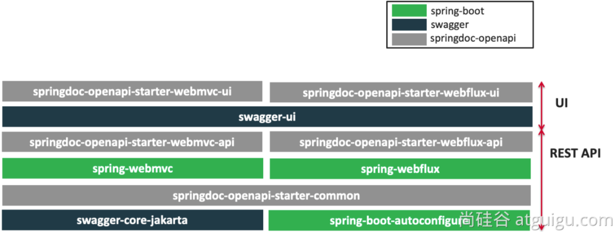

# 02-接口文档

## OpenAPI 3 与 Swagger

Swagger 可以快速生成**实时接口**文档，方便前后开发人员进行协调沟通。遵循 **OpenAPI** 规范。

文档：<https://springdoc.org/v2/>

### OpenAPI 3 架构

### 整合

导入场景

~~~xml
<dependency>
    <groupId>org.springdoc</groupId>
    <artifactId>springdoc-openapi-starter-webmvc-ui</artifactId>
    <version>2.1.0</version>
</dependency>
~~~

配置

~~~xml
# /api-docs endpoint custom path 默认 /v3/api-docs
springdoc.api-docs.path=/api-docs

# swagger 相关配置在  springdoc.swagger-ui
# swagger-ui custom path
springdoc.swagger-ui.path=/swagger-ui.html

springdoc.show-actuator=true
~~~

### 使用

####  常用注解

| 注解         | 标注位置            | 作用                   |
| ------------ | ------------------- | ---------------------- |
| @Tag         | controller 类       | 标识 controller 作用   |
| @Parameter   | 参数                | 标识参数作用           |
| @Parameters  | 参数                | 参数多重说明           |
| @Schema      | model 层的 JavaBean | 描述模型作用及每个属性 |
| @Operation   | 方法                | 描述方法作用           |
| @ApiResponse | 方法                | 描述响应状态码等       |

#### Docket配置

如果有多个Docket，配置如下

~~~java
  @Bean
  public GroupedOpenApi publicApi() {
      return GroupedOpenApi.builder()
              .group("springshop-public")
              .pathsToMatch("/public/**")
              .build();
  }
  @Bean
  public GroupedOpenApi adminApi() {
      return GroupedOpenApi.builder()
              .group("springshop-admin")
              .pathsToMatch("/admin/**")
              .addMethodFilter(method -> method.isAnnotationPresent(Admin.class))
              .build();
  }
~~~

> 如果只有一个Docket，可以配置如下

~~~xml
springdoc.packagesToScan=package1, package2
springdoc.pathsToMatch=/v1, /api/balance/**
~~~

#### OpenAPI配置

~~~java
  @Bean
  public OpenAPI springShopOpenAPI() {
      return new OpenAPI()
              .info(new Info().title("SpringShop API")
              .description("Spring shop sample application")
              .version("v0.0.1")
              .license(new License().name("Apache 2.0").url("http://springdoc.org")))
              .externalDocs(new ExternalDocumentation()
              .description("SpringShop Wiki Documentation")
              .url("https://springshop.wiki.github.org/docs"));
  }
~~~

### Springfox 迁移

#### 注解变化

| 原注解                                      | 现注解                                                       | 作用           |
| ------------------------------------------- | ------------------------------------------------------------ | -------------- |
| @Api                                        | @Tag                                                         | 描述Controller |
| @ApiIgnore                                  | @Parameter(hidden = true)  @Operation(hidden = true) @Hidden | 描述忽略操作   |
| @ApiImplicitParam                           | @Parameter                                                   | 描述参数       |
| @ApiImplicitParams                          | @Parameters                                                  | 描述参数       |
| @ApiModel                                   | @Schema                                                      | 描述对象       |
| @ApiModelProperty(hidden = true)            | @Schema(accessMode = READ_ONLY)                              | 描述对象属性   |
| @ApiModelProperty                           | @Schema                                                      | 描述对象属性   |
| @ApiOperation(value = "foo", notes = "bar") | @Operation(summary = "foo", description = "bar")             | 描述方法       |
| @ApiParam                                   | @Parameter                                                   | 描述参数       |
| @ApiResponse(code = 404, message = "foo")   | @ApiResponse(responseCode = "404", description = "foo")      | 描述响应       |

#### Docket配置

以前写法：

~~~java
  @Bean
  public Docket publicApi() {
      return new Docket(DocumentationType.SWAGGER_2)
              .select()
              .apis(RequestHandlerSelectors.basePackage("org.github.springshop.web.public"))
              .paths(PathSelectors.regex("/public.*"))
              .build()
              .groupName("springshop-public")
              .apiInfo(apiInfo());
  }

  @Bean
  public Docket adminApi() {
      return new Docket(DocumentationType.SWAGGER_2)
              .select()
              .apis(RequestHandlerSelectors.basePackage("org.github.springshop.web.admin"))
              .paths(PathSelectors.regex("/admin.*"))
              .apis(RequestHandlerSelectors.withMethodAnnotation(Admin.class))
              .build()
              .groupName("springshop-admin")
              .apiInfo(apiInfo());
  }
~~~

新写法：

~~~java
  @Bean
  public GroupedOpenApi publicApi() {
      return GroupedOpenApi.builder()
              .group("springshop-public")
              .pathsToMatch("/public/**")
              .build();
  }
  @Bean
  public GroupedOpenApi adminApi() {
      return GroupedOpenApi.builder()
              .group("springshop-admin")
              .pathsToMatch("/admin/**")
              .addOpenApiMethodFilter(method -> method.isAnnotationPresent(Admin.class))
              .build();
  }
~~~

添加OpenAPI组件

~~~java
  @Bean
  public OpenAPI springShopOpenAPI() {
      return new OpenAPI()
              .info(new Info().title("SpringShop API")
              .description("Spring shop sample application")
              .version("v0.0.1")
              .license(new License().name("Apache 2.0").url("http://springdoc.org")))
              .externalDocs(new ExternalDocumentation()
              .description("SpringShop Wiki Documentation")
              .url("https://springshop.wiki.github.org/docs"));
  }
~~~

