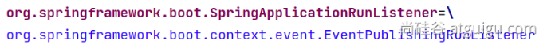
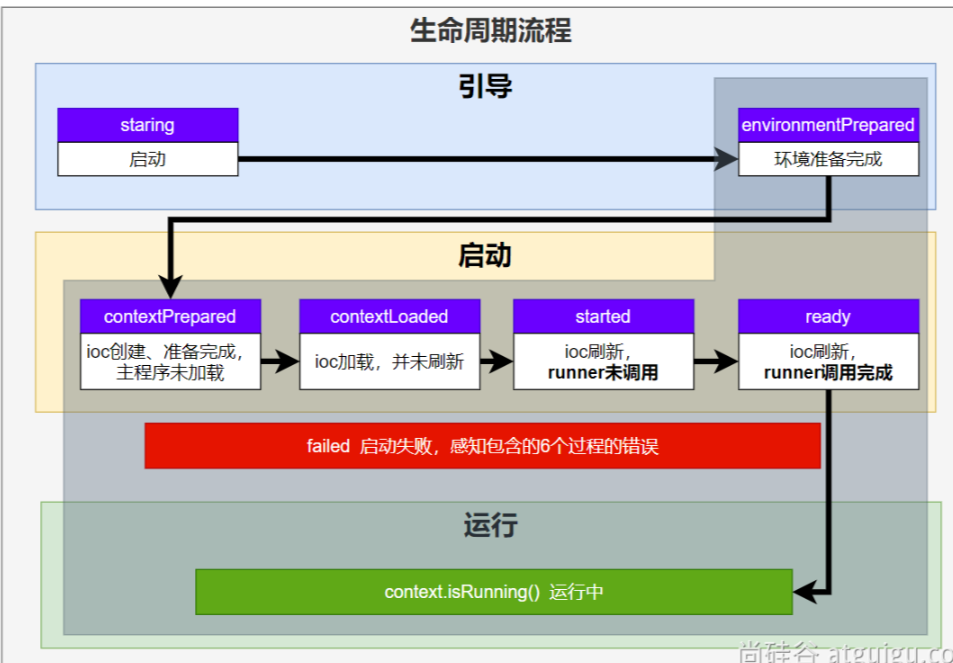
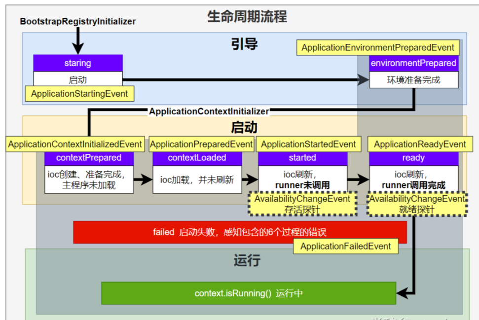
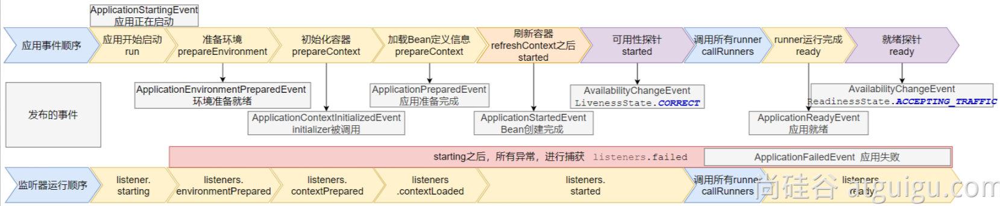
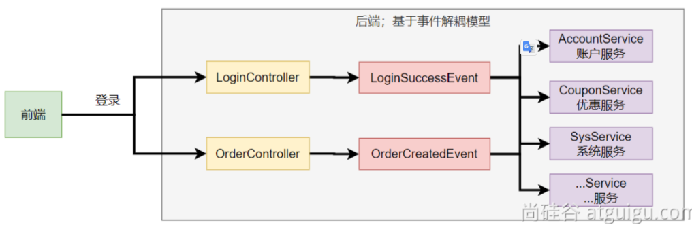
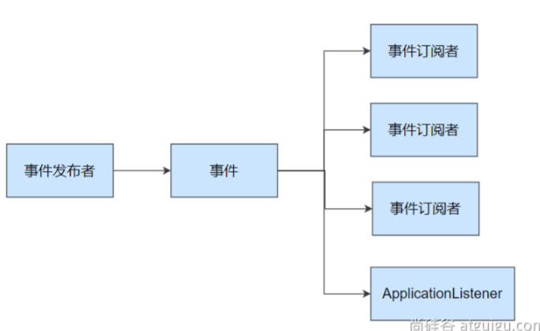

# 05-SpringBoot3核心原理

## 事件和监听器

### 生命周期监听

场景：监听**应用**的**生命周期**

#### 监听器-SpringApplicationRunListener

* 自定义`SpringApplicationRunListener`来**监听事件**；

1. * 编写`SpringApplicationRunListener` **实现类**

2. * 在 `META-INF/spring.factories` 中配置 `org.springframework.boot.SpringApplicationRunListener=自己的Listener`，还可以指定一个**有参构造器**，接受两个参数`(SpringApplication application, String[] args)`

3. * springboot 在`spring-boot.jar`中配置了默认的 Listener，如下

~~~java
/**
 * Listener先要从 META-INF/spring.factories 读到
 *
 * 1、引导： 利用 BootstrapContext 引导整个项目启动
 *      starting：              应用开始，SpringApplication的run方法一调用，只要有了 BootstrapContext 就执行
 *      environmentPrepared：   环境准备好（把启动参数等绑定到环境变量中），但是ioc还没有创建；【调一次】
 * 2、启动：
 *      contextPrepared：       ioc容器创建并准备好，但是sources（主配置类）没加载。并关闭引导上下文；组件都没创建  【调一次】
 *      contextLoaded：         ioc容器加载。主配置类加载进去了。但是ioc容器还没刷新（我们的bean没创建）。
 *      =======截止以前，ioc容器里面还没造bean呢=======
 *      started：               ioc容器刷新了（所有bean造好了），但是 runner 没调用。
 *      ready:                  ioc容器刷新了（所有bean造好了），所有 runner 调用完了。
 * 3、运行
 *     以前步骤都正确执行，代表容器running。
 */
~~~

#### 生命周期全流程

###  事件触发时机

#### 各种回调监听器

- `BootstrapRegistryInitializer`： **感知特定阶段：**感知**引导初始化**

- - `META-INF/spring.factories`
  - 创建引导上下文`bootstrapContext`的时候触发。
  - application.`addBootstrapRegistryInitializer`();
  - 场景：`进行密钥校对授权。`

- **ApplicationContextInitializer**：感知特定阶段：感知ioc容器初始化

- - `META-INF/spring.factories`
  - application.addInitializers();

- **ApplicationListener： 感知全阶段：基于事件机制，感知事件。 一旦到了哪个阶段可以做别的事**

- - `@Bean`或`@EventListener`： `事件驱动`
  - `SpringApplication.addListeners(…)`或 `SpringApplicationBuilder.listeners(…)`
  - `META-INF/spring.factories`

- **SpringApplicationRunListener：感知全阶段生命周期 + 各种阶段都能自定义操作； 功能更完善。**

- - `META-INF/spring.factories`

- **ApplicationRunner: 感知特定阶段：感知应用就绪Ready。卡死应用，就不会就绪**

- - `@Bean`

- **CommandLineRunner:感知特定阶段：感知应用就绪Ready。卡死应用，就不会就绪**

- - `@Bean`

最佳实战：

- 如果项目启动前做事： `BootstrapRegistryInitializer` 和 `ApplicationContextInitializer`
- 如果想要在项目启动完成后做事：`ApplicationRunner`**和** `CommandLineRunner`
- **如果要干涉生命周期做事：**`SpringApplicationRunListener`
- **如果想要用事件机制：**`ApplicationListener`

#### 完整触发流程

`9大事件`触发顺序&时机

1. `ApplicationStartingEvent`：应用启动但未做任何事情, 除过注册listeners and initializers.
2. `ApplicationEnvironmentPreparedEvent`：  Environment 准备好，但context 未创建.
3. `ApplicationContextInitializedEvent`: ApplicationContext 准备好，ApplicationContextInitializers 调用，但是任何bean未加载
4. `ApplicationPreparedEvent`： 容器刷新之前，bean定义信息加载
5. `ApplicationStartedEvent`： 容器刷新完成， runner未调用

=========以下就开始插入了**探针机制**============

6. `AvailabilityChangeEvent`： `LivenessState.CORRECT`应用存活； **存活探针**

7. `ApplicationReadyEvent`: 任何runner被调用

8. `AvailabilityChangeEvent`：`ReadinessState.ACCEPTING_TRAFFIC`**就绪探针**，可以接请求

9. `ApplicationFailedEvent `：启动出错

应用事件发送顺序如下：

感知应用是否**存活**了：可能植物状态，虽然活着但是不能处理请求。

应用是否**就绪**了：能响应请求，说明确实活的比较好。

#### SpringBoot 事件驱动开发

**应用启动过程生命周期事件感知（9大事件）**、**应用运行中事件感知（无数种）**。

- **事件发布**：`ApplicationEventPublisherAware`或`注入：ApplicationEventMulticaster`
- **事件监听**：`组件 + @EventListener`

> 事件发布者

~~~java
@Service
public class EventPublisher implements ApplicationEventPublisherAware {

    /**
     * 底层发送事件用的组件，SpringBoot会通过ApplicationEventPublisherAware接口自动注入给我们
     * 事件是广播出去的。所有监听这个事件的监听器都可以收到
     */
    ApplicationEventPublisher applicationEventPublisher;

    /**
     * 所有事件都可以发
     * @param event
     */
    public void sendEvent(ApplicationEvent event) {
        //调用底层API发送事件
        applicationEventPublisher.publishEvent(event);
    }

    /**
     * 会被自动调用，把真正发事件的底层组组件给我们注入进来
     * @param applicationEventPublisher event publisher to be used by this object
     */
    @Override
    public void setApplicationEventPublisher(ApplicationEventPublisher applicationEventPublisher) {
        this.applicationEventPublisher = applicationEventPublisher;
    }
}
~~~

> 事件订阅者

~~~java
@Service
public class CouponService {

    @Order(1)
    @EventListener
    public void onEvent(LoginSuccessEvent loginSuccessEvent){
        System.out.println("===== CouponService ====感知到事件"+loginSuccessEvent);
        UserEntity source = (UserEntity) loginSuccessEvent.getSource();
        sendCoupon(source.getUsername());
    }

    public void sendCoupon(String username){
        System.out.println(username + " 随机得到了一张优惠券");
    }
}
~~~

